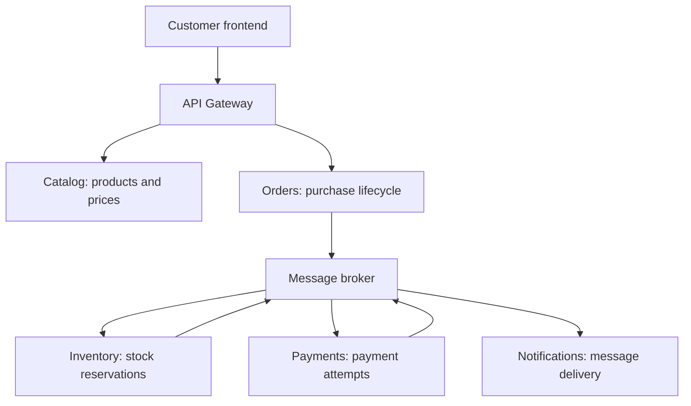
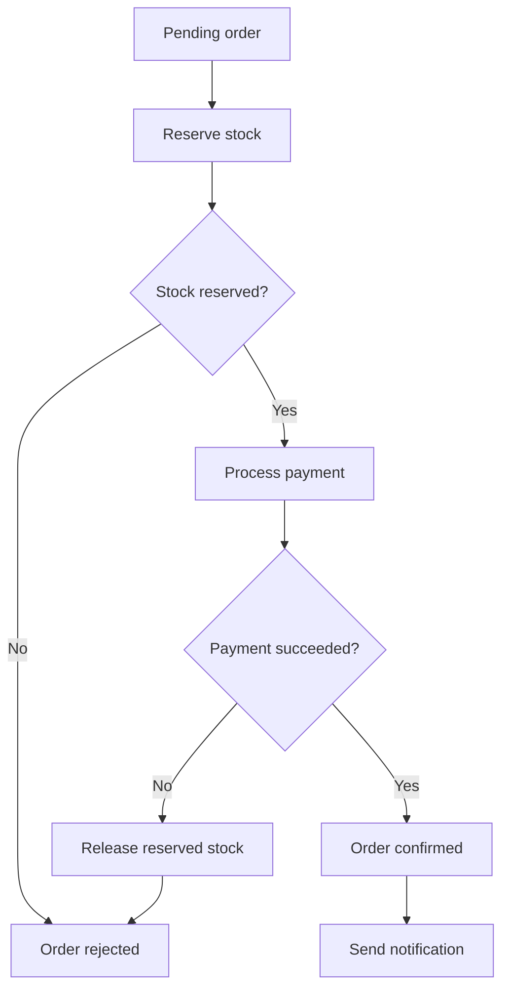

**Chapter 1 of 10: Requirements and architecture**

We’ll design **ShopEasy**, our small ecommerce application. Today, we decide **what the system must do, where each service’s responsibility ends, and why we separate it**.

**Time:** About 15–20 minutes. No coding yet—we first establish what we are building.

### 1. Start with the business problem

A customer wants to buy two keyboards.

The system must:

1. Display products and current prices.
2. Accept the customer’s order.
3. Reserve two keyboards from stock.
4. Process a simulated payment.
5. Confirm the order and notify the customer.

But what happens if payment fails after stock is reserved? Or if the customer clicks **Place order** twice?

**Architecture must handle these situations as well as the successful purchase.**

### 2. Define the scope

We’ll keep the business small while making its technical behavior realistic.

| Included | Deferred |
|---|---|
| Browse products | Recommendations and advanced search |
| Place an order | Discounts and coupons |
| Reserve stock | Multiple warehouses |
| Simulate payment success or failure | Real payment provider |
| View order status | Shipping and returns |
| Send a confirmation | Multiple notification channels |
| Authenticate customers | Complex account management |

Initially, the cart can live in the frontend. It does not need a separate microservice.

### 3. Write requirements before choosing tools

**Functional requirements** describe what the application does.

| ID | Requirement | Acceptance example |
|---|---|---|
| F1 | Browse products | Customer sees name, price, and product ID |
| F2 | Place an order | A valid request returns an order ID and `Pending` status |
| F3 | Reserve inventory | Reserving two items reduces available stock by two |
| F4 | Process payment | Simulator can produce success or failure |
| F5 | Track the order | Customer can see their order’s current status |
| F6 | Notify the customer | A confirmed order triggers a notification |

**Quality requirements** describe how well it must behave. These are initial learning targets, which we will validate later.

| Concern | Initial target | Architectural consequence |
|---|---|---|
| Correctness | Stock must never become negative | Atomic reservation inside Inventory |
| Duplicate requests | Retrying checkout must not create another order | Idempotency key |
| Responsiveness | Accept an order without waiting for the entire workflow | Asynchronous processing |
| Reliability | Confirmed orders survive service restarts | Durable database and messaging |
| Security | Customers access only their own orders | Authorization in Orders |
| Diagnosis | Trace one checkout across services | Correlation IDs and distributed tracing |
| Deployment | Release a service independently | Separate images and deployment definitions |

**Example:** “Use Kafka” is a technology choice. “Retain events so consumers can replay them” is a requirement that might justify Kafka.

### 4. Why microservices here?

Imagine everything runs in one application:

- Browsing products receives heavy traffic.
- Notifications become slow.
- A checkout change requires deploying the entire application.

Microservices give us separate deployment and scaling boundaries. They also introduce network failures, message duplicates, and distributed workflows.

**For a small shop, a modular monolith could be a sensible starting point. We choose microservices here because learning their design and operation is our explicit goal.**

### 5. Choose boundaries around business responsibilities



The broker carries different commands and events. These arrows summarize communication, rather than showing the exact checkout sequence.

| Service | Owns | Does not decide |
|---|---|---|
| Catalog | Product descriptions and current prices | Whether an order is confirmed |
| Orders | Purchased items, agreed prices, order status, workflow | How stock is reserved internally |
| Inventory | Stock quantities and reservations | Whether payment succeeded |
| Payments | Payment attempts and outcomes | Whether products exist |
| Notifications | Notification delivery and retries | Whether checkout succeeded |

**Boundary test:** Can we change Inventory’s reservation logic without changing Orders’ database or business code? A clear contract should make that possible.

### 6. Give each service ownership of its data

| Database | Example tables |
|---|---|
| Catalog database | `Products` |
| Orders database | `Orders`, `OrderItems`, `OutboxMessages` |
| Inventory database | `StockItems`, `Reservations` |
| Payments database | `PaymentAttempts` |
| Notifications database | `NotificationDeliveries` |

**A service must not directly read or update another service’s tables.**

Why? If Orders depends on Inventory’s table structure, an Inventory schema change could break Orders. Independent deployments become difficult.

Instead:

- Use an **API** when an immediate response is needed.
- Use a **message** when work can happen asynchronously.
- Keep a local snapshot when historical information must remain stable.

For example, Orders stores the keyboard’s **agreed unit price**. If Catalog changes its price tomorrow, yesterday’s order remains unchanged.

The databases can initially share a PostgreSQL server, with separate databases and restricted credentials.

### 7. Design the checkout workflow

Orders coordinates the business process.



This coordinated workflow is called an **orchestrated saga**.

A saga uses several local transactions and compensating actions. There is no single database transaction covering all services.

**Example:**

- Inventory commits a stock reservation in its database.
- Payments records a declined payment in its database.
- Orders requests that Inventory release the reservation.

Releasing stock is a **compensating action**. It is a new operation that reverses the business effect of the reservation.

Temporary technical failures require retries or reconciliation; they do not automatically mean the business operation was rejected.

### 8. Decide what is synchronous and asynchronous

| Operation | Communication | Why |
|---|---|---|
| Browse products | HTTP request to Catalog | Customer needs the result immediately |
| Submit order | HTTP request to Orders | Customer needs an acknowledgement |
| Obtain authoritative prices during checkout | Orders calls Catalog | Client-supplied prices cannot be trusted |
| Reserve stock | Message command | Allows processing independently of the HTTP request |
| Report stock reservation | Message event | Tells Orders what happened |
| Process payment | Message command | Continues the background workflow |
| Send confirmation | Message event | Notification failure should not block checkout |
| View order status | HTTP request to Orders | Returns the currently recorded state |

**Command:** asks a service to do something—`ReserveStock`.

**Event:** reports something that happened—`StockReserved`.

The initial order response means **“We accepted your request.”** It does not mean payment and stock reservation have finished.

### 9. Address the important failure cases

| Situation | Design response |
|---|---|
| Customer retries the same checkout | Reuse the result associated with the idempotency key |
| Two customers request the last item | Inventory uses an atomic update or concurrency control |
| Order saved, but broker unavailable | Save an outbox message in the same database transaction |
| Worker receives a message twice | Track processing and make the business operation idempotent |
| Payment fails | Release the reservation |
| Notification fails | Retry separately; keep the order confirmed |
| Workflow becomes stuck | Detect overdue states and reconcile them |

**Outbox example:** Orders saves both the new order and a message to publish in one local transaction. A background publisher sends that message later.

Delivery can still happen more than once, so consumers must handle duplicates.

### 10. Record our architecture decisions

An **Architecture Decision Record—ADR** captures a choice, its reason, and its consequences.

| Decision | Reason | Tradeoff |
|---|---|---|
| Five business services | Clear responsibilities and useful learning coverage | More components to operate |
| Orders coordinates checkout | Workflow is easy to understand and inspect | Orders owns coordination logic |
| Database ownership per service | Supports independent changes | Cross-service queries need APIs or projections |
| REST for immediate queries | Easy to inspect and debug | Runtime dependency on the called service |
| Messaging for checkout steps | Durable asynchronous workflow | Eventual consistency and duplicate handling |
| AKS as deployment target | Learn Kubernetes operation | Greater operational effort |

An architect revisits decisions when requirements change.

### 11. Turn the design into a backlog

We will build **one small working purchase flow**, then strengthen it.

| Priority | Work item | Done when |
|---|---|---|
| 1 | Browse products | Catalog returns seeded products |
| 2 | Accept an order | Orders persists validated items and price snapshots |
| 3 | Reserve inventory | Reservation succeeds or reports insufficient stock |
| 4 | Simulate payment | Success and failure paths work |
| 5 | Coordinate checkout | Orders reaches confirmed or rejected status correctly |
| 6 | Send notification | Confirmation triggers a delivery attempt |
| 7 | Add reliability | Duplicate and temporary-failure scenarios are verified |

Our learning repository will keep service code, infrastructure, and documentation together:

```text
ShopEasy/
  src/
    Catalog/
    Orders/
    Inventory/
    Payments/
    Notifications/
    Gateway/
    Web/
  tests/
  deploy/
  infrastructure/
  docs/
```

One repository does not require one deployment. Each service will have its own build and deployment boundary.

**What to remember for interviews:**

- Define business and quality requirements before selecting technology.
- Split services around business responsibilities.
- Each service owns its data.
- Use synchronous calls for immediate answers and messaging for background workflows.
- A saga coordinates local transactions through compensating actions.
- Outbox protects against losing messages after database commits.
- Idempotency protects against duplicate requests and messages.
- Microservices enable independence while adding distributed-system complexity.

**Next: Chapter 2—build Catalog and Orders in ASP.NET Core, and see where API, Application, Domain, and Infrastructure code belong.**