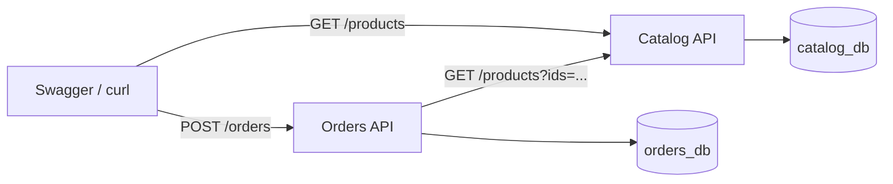
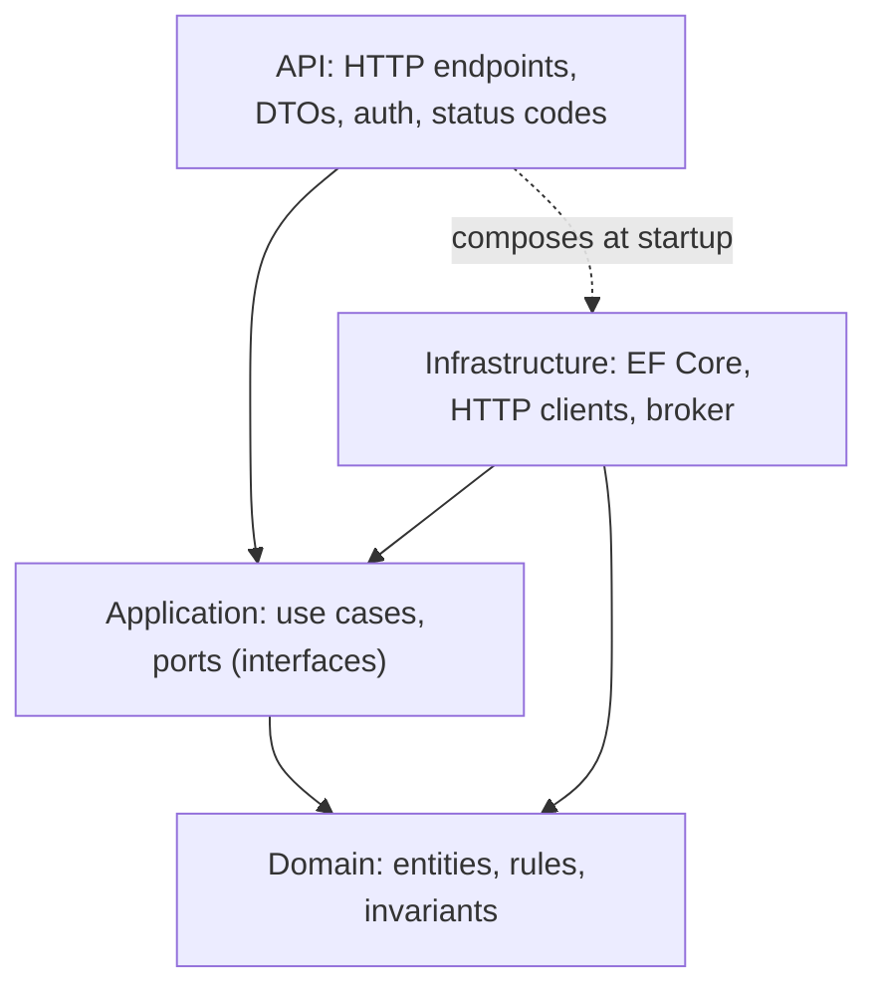
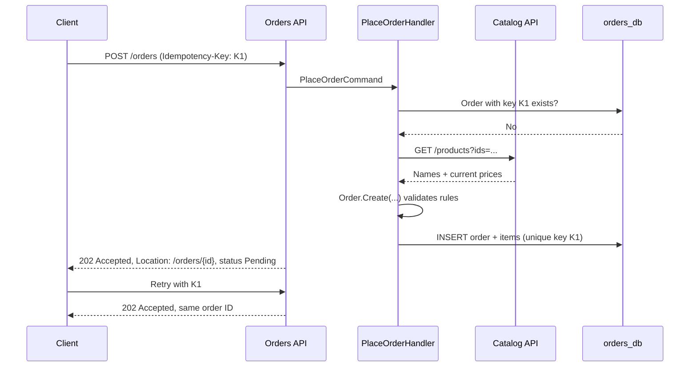

**Chapter 2 of 10: Building Catalog and Orders in ASP.NET Core**

In Chapter 1 we decided **what** ShopEasy does and **where** each responsibility lives. Today we write the first two services—**Catalog** and **Orders**—and decide **where each piece of code belongs and why**.

**Time:** About 30–40 minutes. Still no Docker, Kafka, or Azure—just two services that talk over HTTP on your machine.

### 1. What we will have at the end



1. Catalog returns seeded products.
2. Orders accepts an order, asks Catalog for **authoritative prices**, and saves the order as `Pending` with price snapshots.
3. Retrying the same request with the same idempotency key returns the **same** order.

This completes backlog items **1** and **2** from Chapter 1.

### 2. Choose the technology—options and why

Every choice below is a tradeoff. We pick what best serves **learning + production realism**.

**Service framework**

| Option | Strengths | Weaknesses |
|---|---|---|
| **ASP.NET Core (.NET 10 LTS)** | Fast, mature, first-class Azure support, built-in DI, config, logging, health checks, OpenTelemetry | Larger images than Go |
| Node.js (Express/NestJS) | Quick start, huge ecosystem | Weaker typing (unless TS), single-threaded CPU work |
| Java (Spring Boot) | Very mature microservice ecosystem | Heavier memory, slower startup |
| Go | Tiny images, fast startup | Less built-in framework, more hand-written plumbing |

**Choice: ASP.NET Core on .NET 10 (LTS).** It has everything a microservice needs out of the box, and LTS gives 3 years of support.

**API style**

| Option | When it fits |
|---|---|
| **Minimal APIs** | Small, focused services; less ceremony; good performance |
| Controllers (MVC) | Large APIs with many filters, conventions, or teams used to MVC |

**Choice: Minimal APIs**, grouped by feature. Our services are small by design. Controllers would also be correct—this is a style decision, not an architectural one.

**Code organization inside a service**

| Option | Idea | Tradeoff |
|---|---|---|
| Single project | Everything in one folder | Fine for tiny services; rules are easy to break |
| **Clean Architecture (layers)** | Domain → Application → Infrastructure → API | Clear rules; a few more projects |
| Vertical slices | One folder per feature, end to end | Great for feature speed; layering is by convention |

**Choice: lightweight Clean Architecture.** It makes the question “where does this code belong?” explicit—which is today’s learning goal. Catalog is simple, so we will keep it thinner than Orders.

**Data access**

| Option | Strengths | Weaknesses |
|---|---|---|
| **EF Core** | Migrations, change tracking, LINQ, concurrency tokens | Less control over generated SQL |
| Dapper | Full SQL control, very fast | Manual mapping and migrations |

**Choice: EF Core** with the Npgsql provider. We can drop to raw SQL later for Inventory’s atomic reservation.

**Database**

| Option | Fits when |
|---|---|
| **PostgreSQL** (Azure Database for PostgreSQL Flexible Server) | Relational data, open source, cheap, runs anywhere |
| Azure SQL | Team already uses SQL Server |
| Cosmos DB | Global scale, flexible schema, very high write volume |

**Choice: PostgreSQL.** Orders and stock are relational and need transactions. It runs identically on a laptop, in Docker, and in Azure.

### 3. The four layers and their rules



| Layer | Contains | Must NOT contain | Example |
|---|---|---|---|
| **Domain** | Entities, value objects, business rules | EF Core, HTTP, JSON attributes | `Order.Create(...)` rejects quantity 0 |
| **Application** | Use cases, interfaces (ports), DTOs between layers | SQL, `HttpClient`, `HttpContext` | `PlaceOrderHandler` |
| **Infrastructure** | Implementations of ports: DbContext, typed HTTP clients | Business decisions | `CatalogHttpClient : ICatalogClient` |
| **API** | Endpoints, request/response contracts, validation, ProblemDetails | Business rules | `POST /orders` → handler → `202 Accepted` |

**Dependency rule:** arrows point **inward**. Domain knows nothing about the outside world.

**Why?** Tomorrow we replace “call Catalog via HTTP” with “read a local price projection.” Only one Infrastructure class changes. The order rules do not.

### 4. Repository and solution layout

```text
ShopEasy/
  ShopEasy.sln
  Directory.Build.props          # shared: TargetFramework, Nullable, warnings-as-errors
  Directory.Packages.props       # central package versions
  src/
    BuildingBlocks/
      ShopEasy.ServiceDefaults/  # health checks, logging, OpenTelemetry, ProblemDetails
    Catalog/
      Catalog.Api/               # endpoints + EF Core (thin service)
    Orders/
      Orders.Domain/
      Orders.Application/
      Orders.Infrastructure/
      Orders.Api/
  tests/
    Orders.Domain.Tests/
    Orders.Api.Tests/
```

**Why is Catalog only one project?** It is mostly read-only CRUD with almost no rules. Four projects would be ceremony without benefit. **Architecture should match complexity**, not be copied blindly.

**Why `BuildingBlocks`?** Cross-cutting setup (health, telemetry) is identical in every service. Sharing **technical** plumbing is fine; sharing **business** models between services is not—it recouples them.

Creating it:

```bash
dotnet new sln -n ShopEasy
dotnet new webapi -n Catalog.Api -o src/Catalog/Catalog.Api
dotnet new classlib -n Orders.Domain -o src/Orders/Orders.Domain
dotnet new classlib -n Orders.Application -o src/Orders/Orders.Application
dotnet new classlib -n Orders.Infrastructure -o src/Orders/Orders.Infrastructure
dotnet new webapi -n Orders.Api -o src/Orders/Orders.Api
dotnet sln add (ls -r **/*.csproj)

dotnet add src/Orders/Orders.Application reference src/Orders/Orders.Domain
dotnet add src/Orders/Orders.Infrastructure reference src/Orders/Orders.Application
dotnet add src/Orders/Orders.Api reference src/Orders/Orders.Infrastructure
```

### 5. Catalog service

**Model:**

```csharp
public sealed class Product
{
    public Guid Id { get; init; }
    public required string Sku { get; init; }
    public required string Name { get; set; }
    public decimal Price { get; set; }
    public string Currency { get; init; } = "EUR";
}
```

**Endpoints:**

```csharp
var products = app.MapGroup("/api/v1/products");

products.MapGet("/", async (CatalogDbContext db, [FromQuery] Guid[]? ids) =>
{
    var query = db.Products.AsNoTracking();
    if (ids is { Length: > 0 }) query = query.Where(p => ids.Contains(p.Id));
    return await query.Select(p => new ProductDto(p.Id, p.Sku, p.Name, p.Price, p.Currency))
                      .ToListAsync();
});

products.MapGet("/{id:guid}", async (Guid id, CatalogDbContext db) =>
    await db.Products.FindAsync(id) is { } p
        ? Results.Ok(new ProductDto(p.Id, p.Sku, p.Name, p.Price, p.Currency))
        : Results.NotFound());
```

| Design point | Why |
|---|---|
| `ProductDto` instead of returning the entity | The API contract must not change when the table changes |
| `AsNoTracking()` | Read-only queries skip change tracking—faster |
| `?ids=` batch lookup | Orders gets all prices in **one** call, not one per item |
| `/api/v1` | Versioning lets us evolve the contract without breaking callers |

Seed data (keyboard, mouse, monitor) is added through an EF Core migration so every environment starts identically.

### 6. Orders domain—where the rules live

```csharp
// Full state machine is completed in Chapter 5
public enum OrderStatus { Pending, AwaitingPayment, ReleasingStock, Confirmed, Rejected }

public sealed class Order
{
    private readonly List<OrderItem> _items = [];
    public Guid Id { get; private set; }
    public Guid CustomerId { get; private set; }
    public OrderStatus Status { get; private set; }
    public decimal Total => _items.Sum(i => i.UnitPrice * i.Quantity);
    public IReadOnlyList<OrderItem> Items => _items;

    private Order() { } // for EF Core

    public static Order Create(Guid customerId, IEnumerable<OrderItem> items)
    {
        var list = items.ToList();
        if (list.Count == 0) throw new DomainException("An order needs at least one item.");
        if (list.Any(i => i.Quantity <= 0)) throw new DomainException("Quantity must be positive.");

        var order = new Order { Id = Guid.NewGuid(), CustomerId = customerId, Status = OrderStatus.Pending };
        order._items.AddRange(list);
        return order;
    }

    // Status changes (OnStockReserved, OnPaymentSucceeded, ...) are added in Chapter 5.
    // Each checks the current status first, so invalid transitions are impossible.
}

public sealed record OrderItem(Guid ProductId, string ProductName, decimal UnitPrice, int Quantity);
```

| Rule | Where enforced | Why there |
|---|---|---|
| At least one item, positive quantity | `Order.Create` | No code path can create an invalid order |
| Valid status transitions | `Order` methods (Chapter 5) | Status cannot be set to anything from outside (`private set`) |
| Price snapshot | `OrderItem.UnitPrice` | Yesterday’s order keeps yesterday’s price (Chapter 1, §6) |

This is an **aggregate**: `Order` is the only entry point for changing its items and status.

### 7. Orders application—the use case

```csharp
public interface ICatalogClient
{
    Task<IReadOnlyList<CatalogProduct>> GetProductsAsync(IEnumerable<Guid> ids, CancellationToken ct);
}

public sealed class PlaceOrderHandler(IOrderRepository orders, ICatalogClient catalog)
{
    public async Task<PlaceOrderResult> HandleAsync(PlaceOrderCommand cmd, CancellationToken ct)
    {
        // 1. Idempotency: same key → same result
        if (await orders.FindByIdempotencyKeyAsync(cmd.IdempotencyKey, ct) is { } existing)
            return PlaceOrderResult.Existing(existing.Id, existing.Status);

        // 2. Authoritative prices from Catalog (never trust client prices)
        var products = await catalog.GetProductsAsync(cmd.Items.Select(i => i.ProductId), ct);
        var missing = cmd.Items.Select(i => i.ProductId).Except(products.Select(p => p.Id)).ToList();
        if (missing.Count > 0) return PlaceOrderResult.UnknownProducts(missing);

        // 3. Domain creates a valid order
        var order = Order.Create(cmd.CustomerId, cmd.Items.Select(i =>
        {
            var p = products.Single(x => x.Id == i.ProductId);
            return new OrderItem(p.Id, p.Name, p.Price, i.Quantity);
        }));

        // 4. Persist (outbox message is added here in Chapter 4)
        await orders.AddAsync(order, cmd.IdempotencyKey, ct);
        return PlaceOrderResult.Created(order.Id, order.Status);
    }
}
```

**Notice:** the handler depends on **interfaces** (`IOrderRepository`, `ICatalogClient`). It doesn’t know whether Catalog is reached by HTTP, gRPC, or a cache.

**Why no MediatR?** It is optional. A plain handler class registered in DI is easier to read while learning. Add a mediator later only if pipelines (logging, validation) become repetitive.

### 8. Orders infrastructure—talking to the outside

**Persistence (EF Core):**

```csharp
modelBuilder.Entity<Order>(b =>
{
    b.HasKey(o => o.Id);
    b.Property(o => o.Status).HasConversion<string>();
    b.OwnsMany(o => o.Items, i => i.ToTable("OrderItems"));
    b.Property<string>("IdempotencyKey").HasMaxLength(100);
    b.HasIndex("IdempotencyKey").IsUnique();   // the DB guarantees no duplicates
    b.Property<uint>("Version").IsRowVersion(); // optimistic concurrency (xmin)
});
```

The **unique index** is the real protection. Two simultaneous identical requests can both pass the “find existing” check; the database rejects the second insert, and we return the first order.

**Calling Catalog—options:**

| Option | Pros | Cons |
|---|---|---|
| **REST + typed `HttpClient`** | Simple, debuggable, same style as public API | JSON overhead |
| gRPC | Fast, strongly typed contracts | Harder to inspect, needs HTTP/2 |
| Local price projection (events) | No runtime dependency on Catalog | Eventual consistency, more code |

**Choice: REST with a typed client + resilience.**

```csharp
builder.Services.AddHttpClient<ICatalogClient, CatalogHttpClient>(c =>
        c.BaseAddress = new Uri(builder.Configuration["Services:Catalog"]!))
    .AddStandardResilienceHandler(); // retry, timeout, circuit breaker (Polly)
```

**gRPC practice option:** Orders → Catalog is the one internal call where gRPC fits naturally (internal, strongly typed, high frequency). Once the REST version works, adding a gRPC endpoint to Catalog and swapping `CatalogHttpClient` for `CatalogGrpcClient` is a good exercise—only Infrastructure changes, which proves the layering works. Public APIs stay REST.

**Why resilience now?** Over a network, Catalog *will* sometimes be slow or down. Without timeouts, Orders threads pile up waiting; with a circuit breaker, Orders fails fast and recovers.

### 9. Orders API—the HTTP contract

```csharp
app.MapPost("/api/v1/orders", async (
        PlaceOrderRequest req,
        [FromHeader(Name = "Idempotency-Key")] string? key,
        ClaimsPrincipal user,
        PlaceOrderHandler handler,
        CancellationToken ct) =>
    {
        if (string.IsNullOrWhiteSpace(key))
            return Results.Problem("Idempotency-Key header is required.", statusCode: 400);

        var result = await handler.HandleAsync(req.ToCommand(user.GetCustomerId(), key), ct);
        return result switch
        {
            { IsUnknownProducts: true } => Results.Problem("Unknown products.", statusCode: 422),
            _ => Results.Accepted($"/api/v1/orders/{result.OrderId}",
                                  new { result.OrderId, Status = result.Status.ToString() })
        };
    });

app.MapGet("/api/v1/orders/{id:guid}", ...); // returns only the caller's own order
```

| Decision | Why |
|---|---|
| `202 Accepted`, not `201 Created` | Means “we accepted your request”—workflow continues in background (Chapter 1, §8) |
| `Location` header | Client knows where to poll the status |
| `Idempotency-Key` header | Client-generated key makes retries safe |
| ProblemDetails (RFC 9457) | One standard error format across all services |
| Customer ID from token, not body | A customer cannot place orders for someone else |
| Request has **no price field** | Prices come only from Catalog |

Request example:

```http
POST /api/v1/orders
Idempotency-Key: 3f1c9a7e-checkout-1
Content-Type: application/json

{ "items": [ { "productId": "b1f0...", "quantity": 2 } ] }
```

Authentication is stubbed for now (a fixed development customer). Real tokens with Microsoft Entra ID come in a later chapter.

### 10. Cross-cutting setup every service gets

`ShopEasy.ServiceDefaults` exposes one method, `builder.AddServiceDefaults()`:

| Concern | Built-in feature | Why from day one |
|---|---|---|
| Configuration | `appsettings.json` + environment variables | Same image runs in dev, test, prod (12-factor) |
| Health | `/health/live`, `/health/ready` | Kubernetes probes (Chapter 6) need them |
| Logging | Structured logging (JSON) | Searchable logs in Grafana/Loki later |
| Tracing & metrics | OpenTelemetry | Prometheus/Grafana (Chapter 8) plug in without code changes |
| Errors | `AddProblemDetails()` + exception handler | No stack traces leak to clients |
| API docs | OpenAPI document + Swagger UI in Development | Contract is visible and testable |

**Secrets** (connection strings) are never committed. Locally: `dotnet user-secrets`. In Azure: Key Vault (Chapter 7).

**Option worth knowing: .NET Aspire.** It provides service defaults, local orchestration, and a dashboard. It’s an excellent dev experience; we build the defaults by hand first so you understand what Aspire automates.

### 11. Walk through one request



### 12. Test at the right level

| Test type | Target | Example |
|---|---|---|
| Unit | Domain | `Order.Create` with quantity 0 throws |
| Unit | Application | Unknown product → `UnknownProducts` result (fake `ICatalogClient`) |
| Integration | API + real PostgreSQL (Testcontainers) | Same idempotency key twice → one row |
| Contract | Orders ↔ Catalog | Catalog response still matches what Orders expects |

**Why Testcontainers instead of an in-memory DB?** The unique index and concurrency behave like production only in real PostgreSQL.

### 13. Architecture decisions for this chapter

| Decision | Reason | Tradeoff |
|---|---|---|
| ASP.NET Core .NET 10 LTS, Minimal APIs | Complete built-in platform, long support | Team must know C# |
| Clean Architecture for Orders, single project for Catalog | Structure matches complexity | Two styles in one repo |
| EF Core + PostgreSQL | Migrations, transactions, concurrency | Some SQL control lost |
| Orders calls Catalog via REST at checkout | Authoritative prices, simple | Runtime dependency—mitigated by resilience |
| Idempotency via header + unique index | Safe retries, DB-enforced | Clients must send a key |
| `202 Accepted` for orders | Honest about asynchronous workflow | Clients must poll or be notified |
| Shared technical defaults only | Consistency without business coupling | One more project to version |

### 14. Run it

```bash
# PostgreSQL locally (temporary; Docker Compose in Chapter 3)
docker run -d --name pg -e POSTGRES_PASSWORD=dev -p 5432:5432 postgres:17

dotnet ef database update -p src/Catalog/Catalog.Api
dotnet ef database update -p src/Orders/Orders.Infrastructure -s src/Orders/Orders.Api

dotnet run --project src/Catalog/Catalog.Api   # http://localhost:5101
dotnet run --project src/Orders/Orders.Api     # http://localhost:5102
```

**Done when:**

- `GET /api/v1/products` returns the seeded products.
- `POST /api/v1/orders` returns `202` with an order ID and `Pending`.
- Sending the same `Idempotency-Key` twice returns the same order ID.
- Ordering an unknown product returns `422` ProblemDetails.
- The saved order has Catalog’s price, even if the client tried to send another.

**What to remember for interviews:**

- Domain holds rules; Application holds use cases; Infrastructure holds technology; API holds HTTP.
- Dependencies point inward—business code doesn’t depend on EF Core or HTTP.
- Match structure to complexity: not every service needs four projects.
- Never trust client prices; snapshot authoritative prices into the order.
- Idempotency = client key + database unique constraint.
- `202 Accepted` signals that background work continues.
- Every network call needs timeouts, retries, and a circuit breaker.
- Share technical plumbing between services, never business models.

**Next: Chapter 3—containerize Catalog and Orders with Docker and run the whole system locally with Docker Compose.**
