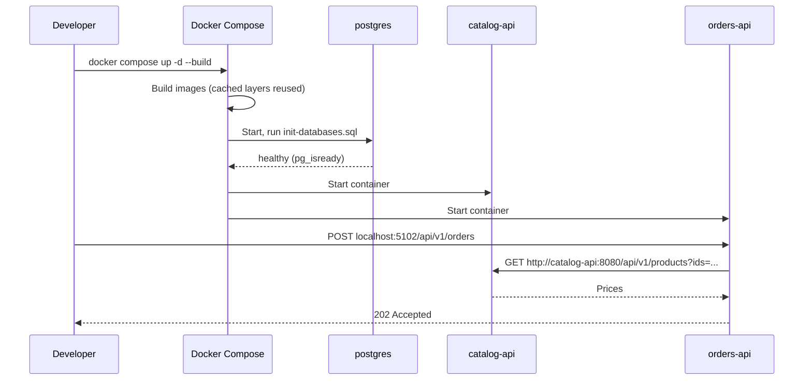

**Chapter 3 of 10: Containers with Docker and Docker Compose**

In Chapter 2 we built Catalog and Orders and ran them with `dotnet run`. That works on **your** machine. Today we package each service as a **container image** and start the whole system—services and PostgreSQL—with **one command**.

**Time:** About 30 minutes. Still no Kubernetes or Azure—just Docker on your laptop.

### 1. The problem containers solve

A new teammate clones ShopEasy. To run it they need:

- The right .NET SDK version.
- PostgreSQL installed and configured.
- The correct ports, connection strings, and startup order.

Then in Azure, the server needs the same things again—and must match exactly.

**“It works on my machine” is a packaging problem.** A container image packages the application **with** its runtime and dependencies. The same image runs on a laptop, in CI, and in AKS.

| Without containers | With containers |
|---|---|
| Install runtime on every server | Runtime is inside the image |
| Configuration drift between environments | Same image everywhere; only config differs |
| Manual startup order | Compose / Kubernetes start and restart services |
| Hard to run 5 services + DB locally | `docker compose up` |

### 2. Key concepts in one place

| Term | Meaning | ShopEasy example |
|---|---|---|
| **Image** | Read-only package: OS layer + runtime + app | `shopeasy/orders-api:1.0.0` |
| **Container** | A running instance of an image | One running Orders API process |
| **Dockerfile** | Recipe to build an image | `src/Orders/Orders.Api/Dockerfile` |
| **Layer** | Cached step of the build | `dotnet restore` result |
| **Registry** | Storage for images | Docker Hub locally, **Azure Container Registry** later |
| **Volume** | Data that survives container restarts | PostgreSQL data files |
| **Network** | Lets containers find each other by name | Orders calls `http://catalog-api:8080` |

**Container vs virtual machine:** a VM virtualizes hardware and runs a full OS; a container shares the host kernel and isolates only the process. Containers start in seconds and use far less memory—so running 7 of them on a laptop is realistic.

### 3. Choose the tools—options and why

**Container runtime for local development**

| Option | Strengths | Weaknesses |
|---|---|---|
| **Docker Desktop** | Most common, Compose built in, great docs | License required for larger companies |
| Podman | Daemonless, rootless, free | Some Compose differences |
| Rancher Desktop | Free, includes local Kubernetes | Smaller community |

**Choice: Docker Desktop** (with WSL 2 on Windows). Every tutorial and CI system speaks Docker. Images we build are standard **OCI** images, so they run anywhere.

**How to build the image**

| Option | Idea | Tradeoff |
|---|---|---|
| **Dockerfile (multi-stage)** | Explicit recipe you control | A file to maintain per service |
| `dotnet publish /t:PublishContainer` | SDK builds the image, no Dockerfile | Less visible; harder to add OS packages |
| Buildpacks | Auto-detect and build | Least control |

**Choice: multi-stage Dockerfile.** You see and understand every step—essential for interviews and debugging. The SDK option is a good shortcut once you know what it does.

**Base image**

| Option | Size | Notes |
|---|---|---|
| `mcr.microsoft.com/dotnet/aspnet:10.0` (Debian) | ~220 MB | Most compatible |
| **`aspnet:10.0-noble-chiseled`** (Ubuntu chiseled) | ~110 MB | No shell, no package manager, runs as non-root |
| `aspnet:10.0-alpine` | ~110 MB | musl libc; occasional compatibility issues |

**Choice: chiseled.** Smaller image means faster pulls and **fewer vulnerabilities**—there is simply less software inside to attack.

**Running multiple containers locally**

| Option | Fits when |
|---|---|
| **Docker Compose** | Local dev and simple integration tests |
| .NET Aspire AppHost | .NET-only teams wanting a dashboard |
| Local Kubernetes (kind, minikube) | Testing Kubernetes manifests themselves |

**Choice: Docker Compose** now. It is language-neutral and simple. Kubernetes comes in Chapter 6, when we actually need it.

### 4. The multi-stage Dockerfile

```dockerfile
# ---------- Stage 1: build ----------
FROM mcr.microsoft.com/dotnet/sdk:10.0 AS build
WORKDIR /src

# Copy only project files first -> restore is cached until dependencies change
COPY Directory.Build.props Directory.Packages.props ./
COPY src/BuildingBlocks/ShopEasy.ServiceDefaults/*.csproj src/BuildingBlocks/ShopEasy.ServiceDefaults/
COPY src/Orders/Orders.Domain/*.csproj         src/Orders/Orders.Domain/
COPY src/Orders/Orders.Application/*.csproj    src/Orders/Orders.Application/
COPY src/Orders/Orders.Infrastructure/*.csproj src/Orders/Orders.Infrastructure/
COPY src/Orders/Orders.Api/*.csproj            src/Orders/Orders.Api/
RUN dotnet restore src/Orders/Orders.Api/Orders.Api.csproj

# Now copy the source and publish
COPY src/ src/
RUN dotnet publish src/Orders/Orders.Api/Orders.Api.csproj \
      -c Release -o /app/publish --no-restore /p:UseAppHost=false

# ---------- Stage 2: runtime ----------
FROM mcr.microsoft.com/dotnet/aspnet:10.0-noble-chiseled AS final
WORKDIR /app
COPY --from=build /app/publish .
EXPOSE 8080
USER $APP_UID
ENTRYPOINT ["dotnet", "Orders.Api.dll"]
```

| Line / idea | Why |
|---|---|
| Two stages | SDK (~800 MB) is needed to **build**, not to **run**. Final image has only the runtime |
| Copy `.csproj` first, then restore | Docker caches the restore layer; changing a `.cs` file doesn’t re-download packages |
| `--no-restore` | Restore already happened in its own cached layer |
| Port `8080` | .NET 8+ images listen on 8080 by default—non-root processes can’t bind port 80 |
| `USER $APP_UID` | Never run as root; limits damage if the app is compromised |
| No secrets in the image | Anyone who can pull the image can read its layers |

**Build context is the repository root**, because Orders depends on `BuildingBlocks` and the shared `Directory.*.props` files.

**`.dockerignore`** keeps the context small and avoids leaking local files:

```text
**/bin/
**/obj/
**/.vs/
**/*.user
**/secrets.json
.git/
tests/
```

Build and run one service:

```bash
docker build -f src/Orders/Orders.Api/Dockerfile -t shopeasy/orders-api:dev .
docker images shopeasy/orders-api    # check the size
```

### 5. Configuration: same image, different environments

The image must not know whether it runs on a laptop or in production. **Configuration comes from outside**, as environment variables (12-factor principle).

ASP.NET Core maps environment variables to configuration keys using a double underscore:

| `appsettings.json` key | Environment variable |
|---|---|
| `ConnectionStrings:OrdersDb` | `ConnectionStrings__OrdersDb` |
| `Services:Catalog` | `Services__Catalog` |

| Environment | Where values come from |
|---|---|
| Local `dotnet run` | `appsettings.Development.json` + user-secrets |
| Docker Compose | `environment:` section + `.env` file (not committed) |
| AKS | ConfigMaps + Key Vault secrets (Chapters 6–7) |

### 6. Docker Compose—the whole system with one command

```yaml
# compose.yaml (repository root)
name: shopeasy

services:
  postgres:
    image: postgres:17
    environment:
      POSTGRES_USER: shopeasy
      POSTGRES_PASSWORD: ${POSTGRES_PASSWORD}
    ports: ["5432:5432"]
    volumes:
      - pgdata:/var/lib/postgresql/data
      - ./deploy/local/init-databases.sql:/docker-entrypoint-initdb.d/init.sql:ro
    healthcheck:
      test: ["CMD-SHELL", "pg_isready -U shopeasy"]
      interval: 5s
      retries: 10

  catalog-api:
    build:
      context: .
      dockerfile: src/Catalog/Catalog.Api/Dockerfile
    image: shopeasy/catalog-api:dev
    environment:
      ASPNETCORE_ENVIRONMENT: Development
      ConnectionStrings__CatalogDb: Host=postgres;Database=catalog_db;Username=catalog_user;Password=${CATALOG_DB_PASSWORD}
    ports: ["5101:8080"]
    depends_on:
      postgres: { condition: service_healthy }

  orders-api:
    build:
      context: .
      dockerfile: src/Orders/Orders.Api/Dockerfile
    image: shopeasy/orders-api:dev
    environment:
      ASPNETCORE_ENVIRONMENT: Development
      ConnectionStrings__OrdersDb: Host=postgres;Database=orders_db;Username=orders_user;Password=${ORDERS_DB_PASSWORD}
      Services__Catalog: http://catalog-api:8080
    ports: ["5102:8080"]
    depends_on:
      postgres: { condition: service_healthy }
      catalog-api: { condition: service_started }

volumes:
  pgdata:
```

`init-databases.sql` creates **one database and one user per service** (Chapter 1, §6):

```sql
CREATE USER catalog_user WITH PASSWORD 'catalog_dev';
CREATE DATABASE catalog_db OWNER catalog_user;
CREATE USER orders_user WITH PASSWORD 'orders_dev';
CREATE DATABASE orders_db OWNER orders_user;
```

| Design point | Why |
|---|---|
| `http://catalog-api:8080` | Compose network has built-in DNS: the **service name is the host name** |
| `ports: "5102:8080"` | Host port 5102 → container port 8080; only needed for access from your browser |
| `pgdata` named volume | Data survives `docker compose down` (but not `down -v`) |
| `healthcheck` + `service_healthy` | Services start only when PostgreSQL actually accepts connections |
| `${POSTGRES_PASSWORD}` from `.env` | Passwords stay out of Git; commit a `.env.example` instead |
| Separate DB users | Orders physically cannot read Catalog’s tables |

**Important:** `depends_on` only controls **startup order**. In production a dependency can disappear at any time. That is why Orders already has retries and a circuit breaker (Chapter 2, §8)—don’t rely on startup order for correctness.

### 7. Database migrations in containers—options

| Option | Pros | Cons |
|---|---|---|
| App migrates on startup (`Database.Migrate()`) | Zero extra steps | Several replicas race each other; app needs DDL permissions |
| **Separate migration step** (EF bundle / job) | Runs once, controlled, least privilege for the app | One more step to run |
| SQL scripts by DBA/pipeline | Fully reviewed | Slowest, manual |

**Choice: separate migration step.** We build an EF Core **migration bundle** (a single executable):

```bash
dotnet ef migrations bundle -p src/Orders/Orders.Infrastructure -s src/Orders/Orders.Api -o efbundle
```

Locally a small `orders-migrator` Compose service runs it once and exits. In Kubernetes it becomes a **Job** that runs before the deployment (Chapter 6). Startup migration is acceptable only for throwaway local experiments.

### 8. Daily developer workflow

```bash
cp .env.example .env               # once
docker compose up -d --build       # build images and start everything
docker compose ps                  # status and health
docker compose logs -f orders-api  # follow one service's logs
docker compose up -d --build orders-api   # rebuild only what changed
docker compose down                # stop (data kept)
docker compose down -v             # stop and delete data
```

**Option:** run infrastructure (PostgreSQL) in Compose and the service you are actively debugging with `dotnet run` from your IDE. You get breakpoints and hot reload while everything else stays containerized.

### 9. Health checks—Docker and beyond

The service already exposes `/health/live` and `/health/ready` (Chapter 2, §10).

| Endpoint | Question it answers | Used by |
|---|---|---|
| `/health/live` | Is the process alive and not stuck? | Restart decision |
| `/health/ready` | Can it serve traffic now (DB reachable)? | Traffic routing |

Chiseled images contain **no `curl`**, so we don’t add a Docker `HEALTHCHECK` with curl. Compose’s `ps` and logs are enough locally; **Kubernetes probes** will call these endpoints from outside the container (Chapter 6).

### 10. Image tagging and the registry

| Tag style | Example | Use |
|---|---|---|
| `dev` / `latest` | `orders-api:latest` | Local only—**never deploy `latest`** |
| Semantic version | `orders-api:1.4.0` | Human-readable releases |
| **Git commit SHA** | `orders-api:3f9c2ab` | Exactly traceable to source |

**Choice: tag every CI build with the commit SHA** (plus a version on releases). When production misbehaves, you know exactly which code is running.

| Registry option | Fits when |
|---|---|
| Docker Hub | Public open-source images |
| GitHub Container Registry | Code and CI already on GitHub |
| **Azure Container Registry (ACR)** | Deploying to AKS—private network, Entra ID auth, vulnerability scanning |

**Choice: ACR**, created with Terraform in Chapter 7 and pushed to by CI/CD in Chapter 9.

### 11. Container security basics

| Practice | Why |
|---|---|
| Non-root user | Limits what an attacker can do inside |
| Minimal (chiseled) base | Fewer packages → fewer CVEs |
| Pin base image versions; rebuild regularly | Get security patches predictably |
| No secrets in images or Dockerfiles | Image layers are readable by anyone who can pull |
| Scan images (Trivy, Defender for Containers) | Find known vulnerabilities before deploy |
| Read-only root filesystem (in Kubernetes) | App can’t be modified at runtime |

### 12. Walk through `docker compose up`



### 13. Architecture decisions for this chapter

| Decision | Reason | Tradeoff |
|---|---|---|
| Docker Desktop, OCI images | Industry standard, portable to AKS | License for large companies |
| Multi-stage Dockerfile per service | Small images, full control, cache-friendly | One file per service |
| Chiseled, non-root base image | Smaller, more secure | No shell for debugging inside |
| Repo root as build context | Shared props and BuildingBlocks are reachable | Needs a good `.dockerignore` |
| Docker Compose for local system | Simple, language-neutral | Not identical to Kubernetes |
| Config via environment variables | Same image in every environment | Many variables to manage |
| Separate migration step | Safe with many replicas, least privilege | Extra step/job |
| Tag images with commit SHA, store in ACR | Traceability, private registry | Tags are not human-friendly |

### 14. Run it

```bash
cp .env.example .env
docker compose up -d --build
docker compose ps
```

**Done when:**

- `docker compose up` starts PostgreSQL, Catalog, and Orders without manual steps.
- `http://localhost:5101/api/v1/products` returns the seeded products.
- `POST http://localhost:5102/api/v1/orders` returns `202`, with Orders reaching Catalog by service name.
- Orders image is roughly 110–130 MB and runs as non-root (`docker inspect` → `User`).
- After `docker compose down` and `up`, existing orders are still there (volume).
- Changing one `.cs` file rebuilds without re-running `dotnet restore`.
- No password appears in any committed file.

**What to remember for interviews:**

- An image is the package; a container is a running instance of it.
- Multi-stage builds separate build tools from the runtime image.
- Order Dockerfile steps from least to most frequently changing to maximize caching.
- Run as non-root on a minimal base image; never bake secrets into images.
- Build once, configure per environment through environment variables.
- In Compose, service names are DNS names on a shared network.
- `depends_on` controls start order, not availability—services still need resilience.
- Run migrations as a separate step, not from every replica at startup.
- Never deploy `latest`; tag images with the commit SHA.

**Next: Chapter 4—asynchronous messaging. Compare Kafka, RabbitMQ, and Azure Service Bus, and add the outbox to Orders so no message is ever lost.**
