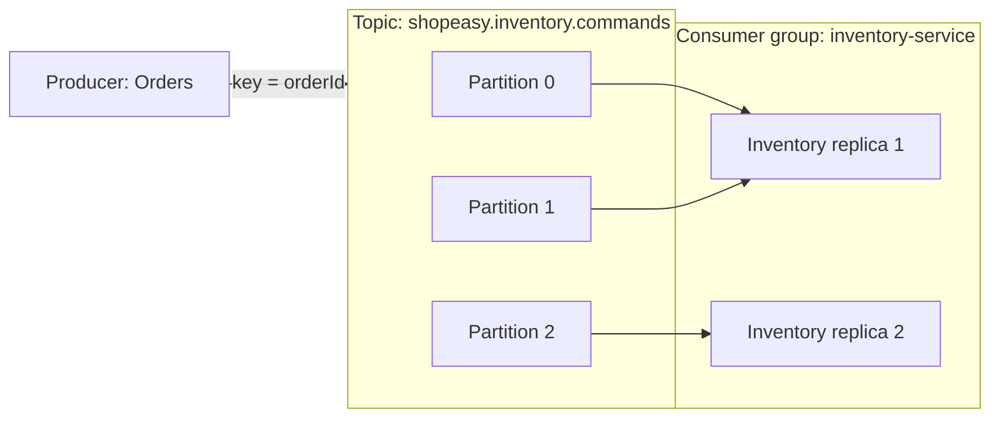
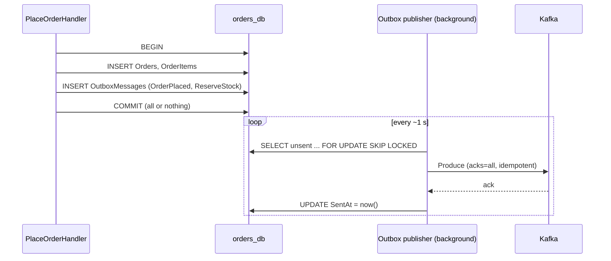

**Chapter 4 of 10: Asynchronous messaging with Kafka and the outbox**

In Chapter 3 the whole system started with one command. But Orders still stops at `Pending`—nothing tells Inventory or Payments to do anything. Today we add a **message broker**, define our **commands and events**, and make sure **no message is ever lost** between the database and the broker.

**Time:** About 40 minutes. Still local—Kafka runs in Docker Compose.

### 1. Why not just call Inventory over HTTP?

Orders could call `POST /inventory/reservations` directly. Consider what happens when:

- Inventory is being deployed for 30 seconds.
- Payments is slow because the (simulated) provider is slow.
- Black Friday sends 10× the usual orders.

With HTTP, Orders must **wait**, **retry**, and **fail** with them. With a broker:

| HTTP call chain | Messaging |
|---|---|
| Caller waits for the full chain | Caller hands over the message and continues |
| Callee down → caller fails | Callee down → message waits in the broker |
| Load spikes hit every service at once | Broker absorbs spikes; consumers work at their own pace |
| Caller knows every receiver | Publisher doesn’t know who listens to an event |

**Cost:** eventual consistency, duplicates, ordering questions, and a new component to operate. That’s why Chapter 1 used HTTP only where an **immediate** answer is needed.

### 2. Messages: commands vs events

| | Command | Event |
|---|---|---|
| Meaning | “Please do this” | “This happened” |
| Naming | Imperative: `ReserveStock` | Past tense: `StockReserved` |
| Receivers | Exactly one logical owner | Zero or many subscribers |
| Can be rejected? | Yes | No—it’s a fact |

ShopEasy’s checkout messages:

| Message | Type | Producer → Consumer |
|---|---|---|
| `OrderPlaced` | Event | Orders → (Orders’ saga, analytics later) |
| `ReserveStock` | Command | Orders → Inventory |
| `StockReserved` / `StockReservationFailed` | Event | Inventory → Orders |
| `ProcessPayment` | Command | Orders → Payments |
| `PaymentSucceeded` / `PaymentFailed` | Event | Payments → Orders |
| `ReleaseStock` | Command | Orders → Inventory (compensation) |
| `OrderConfirmed` / `OrderRejected` | Event | Orders → Notifications |

### 3. Choose the broker—options and why

| Option | Model | Strengths | Weaknesses |
|---|---|---|---|
| **Apache Kafka** | Distributed, partitioned **log** | Very high throughput, **retention & replay**, ordering per key, huge ecosystem | More concepts; no built-in delayed messages or per-message DLQ |
| RabbitMQ | **Queue** broker with exchanges | Flexible routing, simple, per-message ack, DLX | Messages gone after consumption—no replay |
| Azure Service Bus | Managed **queue/topic** | Sessions, DLQ, scheduled messages, transactions; zero ops | Azure-only; lower throughput; no replay |
| Azure Event Hubs | Managed partitioned log, **Kafka-compatible endpoint** | Kafka clients work unchanged; zero ops | Fewer Kafka features (e.g., no compacted topics on lower tiers) |

**Log vs queue in one sentence:** a queue **deletes** a message once consumed; a log **keeps** it, and each consumer group just moves its own bookmark (offset).

**Choice: Kafka (protocol) everywhere.**

- **Locally:** Apache Kafka in Docker (KRaft mode, no ZooKeeper).
- **In Azure:** options are **Event Hubs (Kafka endpoint)**, Confluent Cloud, or self-hosted Kafka on AKS (Strimzi). We plan for **Event Hubs**—managed, and our code stays plain Kafka. Final decision in Chapter 7.

**Why Kafka over Service Bus for us?** Learning Kafka is an explicit goal, and replay is useful: a new service (e.g., analytics) can read all past `OrderConfirmed` events. **Honest note:** for a pure command/workflow system on Azure, Service Bus is often the simpler production choice. Our abstraction (§7) keeps that switch possible.

### 4. Kafka concepts you must know



| Concept | Meaning | Design consequence |
|---|---|---|
| **Topic** | Named stream of messages | One per kind of stream |
| **Partition** | Ordered, append-only slice of a topic | Order guaranteed **only inside a partition** |
| **Key** | Decides the partition | Key = `orderId` → all messages of one order stay in order |
| **Offset** | Position in a partition | Consumer commits it after processing |
| **Consumer group** | Replicas sharing the work | Each partition read by one replica of the group |
| **Retention** | How long messages stay | Enables replay (e.g., 7 days) |
| **Replication factor** | Copies across brokers | 3 in production, 1 locally |

**Scaling rule:** max useful replicas in a group = number of partitions. 6 partitions → up to 6 Inventory pods (Chapter 6, autoscaling).

**Topic design for ShopEasy:**

| Topic | Contains | Key |
|---|---|---|
| `shopeasy.orders.events` | `OrderPlaced`, `OrderConfirmed`, `OrderRejected` | orderId |
| `shopeasy.inventory.commands` | `ReserveStock`, `ReleaseStock` | orderId |
| `shopeasy.inventory.events` | `StockReserved`, `StockReservationFailed` | orderId |
| `shopeasy.payments.commands` | `ProcessPayment` | orderId |
| `shopeasy.payments.events` | `PaymentSucceeded`, `PaymentFailed` | orderId |

Rule: **a topic is owned by one service** (the one that publishes events or receives commands). Message type goes in a header so one topic can carry related messages.

### 5. Message contract—the envelope

```json
{
  "messageId": "6c1e...",          // unique; used for duplicate detection
  "type": "ReserveStock",
  "version": 1,
  "occurredAt": "2026-10-03T10:15:00Z",
  "correlationId": "order-7f3a...",  // ties the whole checkout together
  "causationId": "msg-id-that-caused-this",
  "data": { "orderId": "7f3a...", "items": [ { "productId": "b1f0...", "quantity": 2 } ] }
}
```

| Field | Why |
|---|---|
| `messageId` | Consumers detect duplicates (§9) |
| `correlationId` | Trace one checkout across services in logs (Chapter 8) |
| `version` | Contracts evolve: add optional fields; breaking change → new version |
| Carry needed data | Inventory shouldn’t call back to Orders to learn the items |

**Serialization options:** JSON (readable, simple), Avro/Protobuf + Schema Registry (compact, enforced compatibility). **Choice: JSON now**; a schema registry is worth it when many teams share topics.

**Evolving a message without breaking consumers**

Producers and consumers deploy independently, so for some time **old and new versions run together**—and Kafka retention means old messages can be **replayed** months later.

| Change | Safe? | How |
|---|---|---|
| Add an optional field | ✅ Backward compatible | Consumers ignore unknown fields; new consumers handle a missing field with a default |
| Remove a field consumers use | ❌ Breaking | First stop all consumers using it, then remove (expand–contract, like DB migrations) |
| Rename a field | ❌ Breaking | = add new + later remove old |
| Change meaning or type (`amount` cents → euros) | ❌ Breaking | New message version |

**Breaking change procedure:**

1. Producer publishes **both** `OrderConfirmed` v1 and v2 (or v2 on a new topic).
2. Consumers migrate to v2 one by one.
3. When no consumer reads v1 (check consumer groups / lag), stop publishing it.

**Consumer rules (tolerant reader):** ignore unknown fields, don’t fail on unknown optional values, check `version` and send unsupported ones to the DLT instead of crashing.

**Schema registry option:** Confluent Schema Registry or **Azure Event Hubs Schema Registry** stores Avro/JSON schemas and **rejects incompatible schemas at publish time**. With JSON and a few teams, compatibility **tests in CI** (snapshot of each contract, Chapter 9) give most of the benefit; adopt a registry when many teams share topics.

**Contracts live in each service’s `Contracts` folder** as plain records—copied or published as a small package. Never share **domain** classes.

### 6. The dual-write problem

The naive code:

```csharp
await db.SaveChangesAsync();        // 1. order saved
await producer.ProduceAsync(...);   // 2. Kafka down / process crashes → message lost!
```

Two systems, no shared transaction. Any order of the two steps can fail halfway:

| Order of steps | Failure | Result |
|---|---|---|
| DB, then Kafka | Crash after DB | Order stuck `Pending` forever |
| Kafka, then DB | DB fails after publish | Inventory reserves stock for an order that doesn’t exist |

Distributed transactions (2PC) are not supported by Kafka with PostgreSQL and would couple everything anyway.

### 7. The transactional outbox

**Idea:** write the message into **the same database, in the same transaction** as the business change. A separate publisher sends it later.



**Outbox table:**

| Column | Purpose |
|---|---|
| `Id` (= messageId) | Unique message identity |
| `Topic`, `Key`, `Type` | Where and how to publish |
| `Payload` (jsonb) | The envelope |
| `CreatedAt`, `SentAt`, `Attempts`, `LastError` | Publishing state and diagnosis |

**Application code stays clean**—the handler adds messages through a port, and EF Core saves them in the same `SaveChangesAsync`:

```csharp
order = Order.Create(...);
await orders.AddAsync(order, cmd.IdempotencyKey, ct);
outbox.Add(Topics.InventoryCommands, key: order.Id, new ReserveStock(order.Id, order.Items.ToLines()));
outbox.Add(Topics.OrdersEvents,     key: order.Id, new OrderPlaced(order.Id, order.CustomerId, order.Total));
await unitOfWork.SaveChangesAsync(ct); // one transaction
```

**Publisher details that matter:**

| Detail | Why |
|---|---|
| `FOR UPDATE SKIP LOCKED` | Several Orders replicas publish in parallel without sending the same row twice concurrently |
| Producer `enable.idempotence=true`, `acks=all` | Kafka doesn’t duplicate on producer retries; written to all in-sync replicas |
| Mark sent **after** ack | Crash between produce and update → message sent again (**at-least-once**) |
| Delete/archive old sent rows | Table doesn’t grow forever |

**Outbox options:**

| Option | Pros | Cons |
|---|---|---|
| **Polling publisher (own code)** | Simple, transparent, any DB | ~1 s latency, polling load |
| CDC with Debezium (reads PostgreSQL WAL) | No polling, very low latency | Extra infrastructure (Kafka Connect) |
| Library (MassTransit, Wolverine) | Outbox + inbox + retries built in | Less visible; MassTransit v9+ is commercially licensed |

**Choice: polling publisher.** ~60 lines you fully understand. Debezium is the upgrade path when latency matters.

**What about Dapr?** Dapr is a sidecar runtime (also an **AKS extension**) that gives services one HTTP/gRPC API for pub/sub, state, secrets, and workflows—the broker behind it (Kafka, Service Bus, RabbitMQ) becomes configuration.

| | Dapr | Our approach (Confluent.Kafka + own outbox/inbox) |
|---|---|---|
| Broker swap | Config change | Change one Infrastructure class |
| Outbox | Built-in (state store + pub/sub) | Hand-written, fully visible |
| Learning Kafka itself | Hidden behind the sidecar | Partitions, offsets, commits are explicit |
| Extra moving parts | Sidecar per pod, control plane | None |
| Polyglot teams | Excellent | .NET-centric |

**Not chosen** because understanding the mechanics is our goal. Dapr is a strong choice for polyglot teams or when broker portability matters more than control—worth knowing for interviews.

### 8. Consuming messages safely

```csharp
var config = new ConsumerConfig
{
    BootstrapServers = opts.BootstrapServers,
    GroupId = "inventory-service",
    EnableAutoCommit = false,          // we commit only after successful processing
    AutoOffsetReset = AutoOffsetReset.Earliest
};

while (!stoppingToken.IsCancellationRequested)
{
    var result = consumer.Consume(stoppingToken);
    await dispatcher.HandleAsync(result.Message, stoppingToken); // DB work + outbox
    consumer.Commit(result);                                      // then move the bookmark
}
```

The consumer runs as a **`BackgroundService`** inside the service process—no separate worker project needed yet.

| Commit timing | Guarantee | Risk |
|---|---|---|
| Before processing | At-most-once | Crash → message lost |
| **After processing** | **At-least-once** | Crash → message processed again |
| Kafka transactions | Exactly-once (Kafka→Kafka only) | Doesn’t cover our PostgreSQL writes |

**Choice: at-least-once + idempotent consumers.** “Exactly-once” across a database and a broker is achieved as **at-least-once delivery + exactly-once effect**.

### 9. Idempotent consumers—the inbox

Every consumer records which `messageId`s it has processed, **in the same transaction** as its business change:

```sql
CREATE TABLE InboxMessages (
  MessageId   uuid PRIMARY KEY,
  Consumer    text NOT NULL,
  ProcessedAt timestamptz NOT NULL
);
```

```text
BEGIN
  INSERT INTO InboxMessages (MessageId, ...)   -- duplicate → unique violation → skip
  UPDATE StockItems ... / INSERT Reservations ...
  INSERT INTO OutboxMessages (StockReserved)
COMMIT
```

Plus **natural idempotency** where possible: Inventory keeps one reservation per `orderId`, so a second `ReserveStock` for the same order changes nothing.

**Pattern:** inbox (dedupe) + business change + outbox (next message) = **one local transaction**. This is the core loop of every service in the saga.

### 10. When processing fails

| Failure kind | Example | Handling |
|---|---|---|
| Transient | DB timeout, broker hiccup | Retry in-process with backoff (Polly), a few times |
| Business outcome | Not enough stock | **Not an error**—publish `StockReservationFailed` |
| Poison message | Invalid JSON, unknown version, a bug | Send to dead-letter topic `<topic>.dlt`, commit, alert |

Kafka has no built-in DLQ, so we publish failed messages to `shopeasy.inventory.commands.dlt` with error headers. **Why not retry forever?** One poison message would block its whole partition.

**Ordering:** keying by `orderId` keeps one order’s messages in sequence. Still, the saga checks state—e.g., Orders ignores `PaymentSucceeded` for an already `Rejected` order.

### 11. Kafka in Docker Compose

```yaml
  kafka:
    image: apache/kafka:4.1.0
    ports: ["9092:9092"]
    environment:
      KAFKA_NODE_ID: 1
      KAFKA_PROCESS_ROLES: broker,controller        # KRaft: no ZooKeeper
      KAFKA_LISTENERS: INTERNAL://:29092,EXTERNAL://:9092,CONTROLLER://:9093
      KAFKA_ADVERTISED_LISTENERS: INTERNAL://kafka:29092,EXTERNAL://localhost:9092
      KAFKA_LISTENER_SECURITY_PROTOCOL_MAP: INTERNAL:PLAINTEXT,EXTERNAL:PLAINTEXT,CONTROLLER:PLAINTEXT
      KAFKA_INTER_BROKER_LISTENER_NAME: INTERNAL
      KAFKA_CONTROLLER_LISTENER_NAMES: CONTROLLER
      KAFKA_CONTROLLER_QUORUM_VOTERS: 1@kafka:9093
      KAFKA_OFFSETS_TOPIC_REPLICATION_FACTOR: 1
      KAFKA_AUTO_CREATE_TOPICS_ENABLE: "false"
    healthcheck:
      test: ["CMD-SHELL", "/opt/kafka/bin/kafka-broker-api-versions.sh --bootstrap-server localhost:9092"]
      interval: 10s
      retries: 10

  kafka-ui:
    image: provectuslabs/kafka-ui:latest
    ports: ["8085:8080"]
    environment:
      KAFKA_CLUSTERS_0_NAME: local
      KAFKA_CLUSTERS_0_BOOTSTRAPSERVERS: kafka:29092
```

Services use `Kafka__BootstrapServers: kafka:29092`; your IDE uses `localhost:9092`.

| Design point | Why |
|---|---|
| Two listeners | Containers and your laptop reach Kafka by different addresses |
| Auto-create topics **off** | Topics are created deliberately (partitions, retention) by a `kafka-init` step—later by Terraform/IaC |
| Kafka UI | See topics, messages, and consumer lag while learning |

### 12. Architecture decisions for this chapter

| Decision | Reason | Tradeoff |
|---|---|---|
| Kafka protocol (local Kafka, Event Hubs planned in Azure) | Replay, scale, learning goal; managed in Azure | More concepts than a queue; no native DLQ/delay |
| Commands and events, key = `orderId` | Clear intent; per-order ordering | Topic design to maintain |
| JSON envelope with ids and version | Readable, traceable, evolvable | No enforced schema yet |
| Transactional outbox, polling publisher | No lost messages, simple | ~1 s latency, cleanup needed |
| At-least-once + inbox | Practical “exactly-once effect” | Every consumer must dedupe |
| Dead-letter topics | Poison messages don’t block partitions | Needs monitoring and replay tooling |
| Confluent.Kafka + thin own abstraction | Learn the real mechanics; broker swappable | More code than MassTransit/Wolverine |

### 13. Run it

```bash
docker compose up -d --build
# open Kafka UI at http://localhost:8085
curl -X POST localhost:5102/api/v1/orders -H "Idempotency-Key: k-42" -H "Content-Type: application/json" \
     -d '{"items":[{"productId":"<id>","quantity":2}]}'
```

**Done when:**

- Placing an order writes the order **and** two `OutboxMessages` rows in one transaction.
- `ReserveStock` and `OrderPlaced` appear in Kafka UI with key = orderId and a correlationId.
- Stop Kafka, place an order (still `202`), start Kafka → the message is published.
- Kill Orders between produce and “mark sent” → message is sent twice, and a test consumer’s inbox processes it **once**.
- A malformed message lands in the `.dlt` topic and doesn’t block the next message.

**What to remember for interviews:**

- Commands ask one owner to act; events announce facts to anyone.
- Kafka is a log: partitions give order per key; consumer groups give scale; retention gives replay.
- Partition count caps consumer parallelism.
- Dual writes lose data; the transactional outbox fixes it with one local transaction.
- Delivery is at-least-once—make every consumer idempotent (inbox + natural keys).
- Commit offsets after processing, never before.
- Separate transient errors (retry), business outcomes (events), and poison messages (DLT).
- Kafka vs Service Bus: replay and throughput vs built-in workflow features and simplicity.

**Next: Chapter 5—Inventory, Payments, and Notifications. Implement the orchestrated saga in Orders, atomic stock reservation, compensation, and timeouts for stuck orders.**
