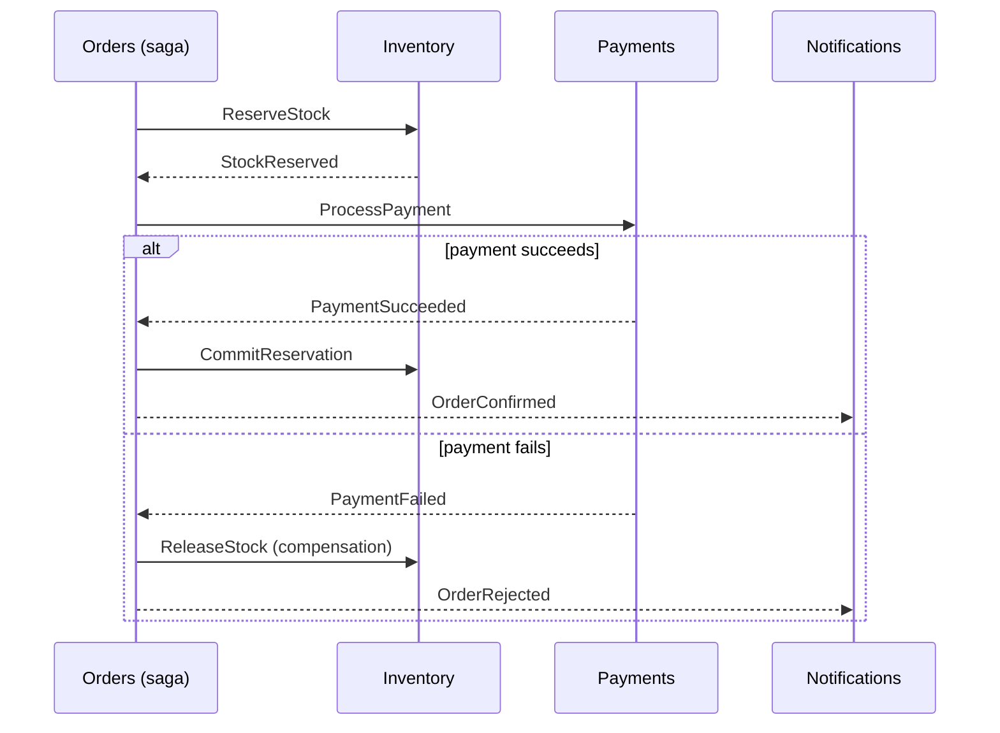
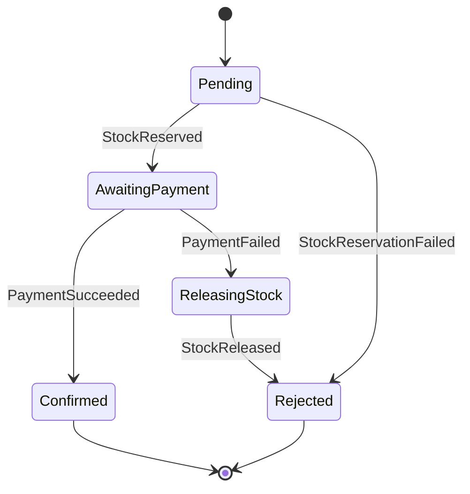
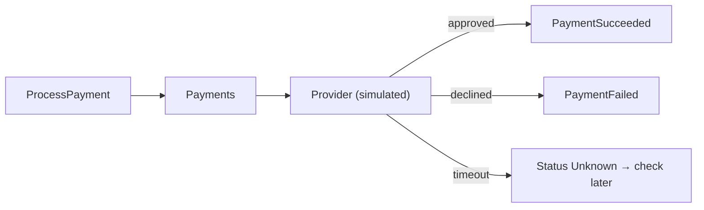

**Chapter 5 of 10: Inventory, Payments, Notifications, and the checkout saga**

In Chapter 4 Orders started publishing `ReserveStock` reliably—but nobody listens yet. Today we build the three remaining services and teach Orders to **drive the checkout to the end**: confirmed, or rejected with stock released.

**Time:** About 45 minutes. Everything still runs in Docker Compose.

### 1. What we will have at the end



This completes backlog items **3–6** from Chapter 1. Every arrow is a Kafka message sent through an **outbox** and received through an **inbox** (Chapter 4).

### 2. Orchestration vs choreography—options and why

| | Orchestration | Choreography |
|---|---|---|
| Idea | One coordinator tells each service what to do | Each service reacts to others’ events |
| Workflow lives in | One place (Orders) | Spread across all services |
| Easy to answer “where is order X?” | Yes—one state record | Hard—must combine several services |
| Coupling | Coordinator knows the participants | Services know each other’s events |
| Fits | Business processes with steps, compensation, timeouts | Simple fan-out (“order confirmed → send email, update analytics”) |

**Choice: orchestration for checkout, choreography for side effects.** Orders orchestrates reserve → pay → confirm/compensate. Notifications (and future analytics) simply **subscribe** to `OrderConfirmed`/`OrderRejected`; Orders doesn’t command them.

**How to implement the orchestrator—options:**

| Option | Pros | Cons |
|---|---|---|
| **Hand-written state machine in Orders** | Fully transparent, uses our inbox/outbox | You write timeouts and state handling |
| MassTransit / NServiceBus sagas | Mature, built-in timeouts | Commercial licenses; framework concepts to learn |
| Durable workflow engine (Temporal, Dapr Workflow, Durable Functions) | Code-as-workflow, retries and timers built in | New infrastructure and runtime model |

**Choice: hand-written state machine.** Checkout has five states; understanding the mechanics is the goal. Temporal is the upgrade path if workflows multiply.

### 3. The order state machine



The rules live in the **Order aggregate** (Chapter 2)—the message handlers only translate messages into method calls:

```csharp
public IReadOnlyList<object> OnStockReserved()
{
    if (Status != OrderStatus.Pending) return [];       // duplicate or late → ignore
    Status = OrderStatus.AwaitingPayment;
    return [ new ProcessPayment(Id, Total, Currency) ];  // next command
}

public IReadOnlyList<object> OnPaymentFailed(string reason)
{
    if (Status != OrderStatus.AwaitingPayment) return [];
    Status = OrderStatus.ReleasingStock;
    RejectionReason = reason;
    return [ new ReleaseStock(Id) ];
}
```

```csharp
// Orders.Application — one handler per incoming event
public async Task Handle(StockReserved msg, MessageContext ctx, CancellationToken ct)
{
    var order = await orders.GetAsync(msg.OrderId, ct);
    foreach (var next in order.OnStockReserved())
        outbox.Add(next, key: order.Id, ctx);           // keeps correlationId
    await unitOfWork.SaveChangesAsync(ct);              // inbox + state + outbox: one transaction
}
```

| Design point | Why |
|---|---|
| Domain method returns the next messages | Workflow rules are unit-testable without Kafka or a DB |
| Unexpected state → ignore, don’t throw | Duplicates and late messages are **normal** in at-least-once systems |
| `Status` + `Version` (concurrency token) | Two messages for the same order can’t overwrite each other’s state |

**State lives in the `Orders` table itself**—the order **is** the saga instance. No separate saga store needed.

### 4. Inventory—never sell what you don’t have

**Data:**

| Table | Columns |
|---|---|
| `StockItems` | `ProductId`, `OnHand`, `Reserved` (available = OnHand − Reserved) |
| `Reservations` | `OrderId` (unique), `ProductId`, `Quantity`, `Status` (Held / Committed / Released), `ExpiresAt` |

**The race:** two customers want the last keyboard at the same moment. Read-check-write in C# lets both succeed. Options:

| Option | How | Tradeoff |
|---|---|---|
| **Atomic conditional UPDATE** | One SQL statement checks and changes | Fast, simple; logic in SQL |
| Optimistic concurrency (row version) | Read, change, save; retry on conflict | More round-trips under contention |
| Pessimistic lock (`SELECT ... FOR UPDATE`) | Lock the row first | Lock waits under load |
| Distributed lock (Redis) | External lock | Extra component; easy to get wrong |

**Choice: atomic conditional UPDATE**—the database guarantees correctness:

```sql
UPDATE "StockItems"
SET    "Reserved" = "Reserved" + @qty
WHERE  "ProductId" = @productId
  AND  "OnHand" - "Reserved" >= @qty;
-- 1 row affected → reserved; 0 rows → insufficient stock
```

Plus a database check constraint `Reserved <= OnHand` as a last line of defence. Multiple items in one order are reserved **in one transaction**—all or nothing.

**Idempotency:** `Reservations.OrderId` is unique. A second `ReserveStock` for the same order finds the existing reservation and re-publishes the **same** outcome instead of reserving again.

**Commands Inventory handles:**

| Command | Effect | Reply |
|---|---|---|
| `ReserveStock` | Hold quantities | `StockReserved` / `StockReservationFailed` |
| `CommitReservation` | Held → Committed, decrease `OnHand` and `Reserved` | (none needed) |
| `ReleaseStock` | Held → Released, decrease `Reserved` | `StockReleased` |

**Why commit separately?** A held reservation can expire. If Orders disappears mid-checkout, a background job releases holds past `ExpiresAt`—stock never stays locked forever.

### 5. Payments—a simulator with real behaviour

We don’t integrate a real provider, but we design as if we did.

| Concern | Design |
|---|---|
| Simulation | Amount ending in `.13` → fail (“card declined”); config `FailureRate` for random failures; configurable delay |
| Idempotency | `PaymentAttempts.OrderId` unique; the **same idempotency key is sent to the provider** |
| Unknown result | Provider timeout ≠ failure → status `Unknown`, query the provider later (**never charge twice**) |
| Data | Store amount, currency, provider reference, outcome—**never card numbers** (PCI scope) |

**Option for real life:** Stripe/Adyen with webhooks. The provider’s webhook becomes just another incoming event to Payments, which then publishes `PaymentSucceeded`/`PaymentFailed`. Orders doesn’t change.



### 6. Notifications—a pure subscriber

| Aspect | Design | Why |
|---|---|---|
| Trigger | Subscribes to `shopeasy.orders.events` | Choreography—Orders doesn’t wait for it |
| Data | `NotificationDeliveries` (OrderId + Type unique) | Never email the same confirmation twice |
| Channel | Log/console sender locally; option: Azure Communication Services or SendGrid | Swappable behind `INotificationSender` |
| Failure | Retry with backoff; after N attempts → `Failed`, alert | **Order stays confirmed**—notification is not part of the business transaction |
| Customer data | Event carries `CustomerId`; Notifications keeps its own email lookup (projection) | No synchronous call to another service while handling a message |

### 7. Timeouts—what if nobody answers?

A message can be stuck in a DLT, a service can have a bug, a payment can stay `Unknown`. Without timeouts, orders sit in `Pending` forever.

**Options:**

| Option | Pros | Cons |
|---|---|---|
| **Deadline column + periodic sweeper** | Simple, uses the DB we have | Polling; granularity of the interval |
| Scheduled/delayed messages | Precise | Kafka has no native delay (Service Bus does) |
| Workflow engine timers | Built in | New infrastructure |

**Choice: deadline + sweeper.** Each state transition sets `StateDeadline`:

| State | Deadline | On timeout |
|---|---|---|
| `Pending` | 2 min | Re-send `ReserveStock` once (idempotent), then reject |
| `AwaitingPayment` | 5 min | Ask Payments for status; if still unknown → alert, **don’t** blindly release |
| `ReleasingStock` | 2 min | Re-send `ReleaseStock` |

```sql
SELECT "Id" FROM "Orders"
WHERE  "Status" NOT IN ('Confirmed','Rejected') AND "StateDeadline" < now()
FOR UPDATE SKIP LOCKED LIMIT 100;
```

**Key insight:** a timeout is **not** proof of failure. Re-sending is safe only because every consumer is idempotent (Chapter 4).

### 8. Price and stock consistency check

What can go wrong across services, and who detects it:

| Inconsistency | Detected by | Fix |
|---|---|---|
| Stock held for a rejected order | Inventory expiry job | Auto-release |
| Order confirmed but notification failed | Notifications retry + alert | Manual resend |
| Payment charged but order rejected (late `PaymentSucceeded`) | Orders ignores, raises `RefundRequired` alert | Refund (manual in our scope) |
| Order stuck | Sweeper + metric “orders in non-final state > 10 min” (Chapter 8) | Investigate |

**Eventual consistency means designing the reconciliation, not hoping it never happens.**

### 8a. Queries across services—“My orders” with product details

The customer’s order history page needs: order status and totals (**Orders**) + product name and image (**Catalog**). We can’t `JOIN` across databases. Options:

| Option | How | Pros | Cons |
|---|---|---|---|
| **Snapshot at write time** | Orders stores `ProductName` (and image URL) in `OrderItems` | One query, no runtime dependency; shows what was bought | Data can be stale (fine—it’s history) |
| API composition (BFF) | BFF calls Orders, then Catalog for product details, merges | Always current | Two calls, Catalog dependency, N+1 risk |
| **CQRS read model (projection)** | A service consumes events and builds a denormalized `CustomerOrderView` table | Fast, flexible queries; no runtime calls | Eventual consistency; more code and a store to maintain |

**Choice—by need:**

- **Order history:** snapshot (already done in Chapter 2—`OrderItem.ProductName`). What was bought shouldn’t change if the product is renamed.
- **Current product info next to an order** (e.g., “buy again” with today’s price): **API composition in the BFF**, using Catalog’s batch endpoint (`?ids=`).
- **Projection** when queries become complex (filters, search across orders and shipments, admin reporting). Example: Orders consumes `ProductUpdated` from Catalog into a local `ProductProjection` table, or a dedicated reporting service builds views from all events.

**CQRS in one sentence:** separate the model you **write** (the `Order` aggregate, enforcing rules) from the models you **read** (flat tables shaped for screens). It doesn’t require separate services or event sourcing—start with one read table.

### 9. Service layout

Each new service uses the same pattern as Orders, sized to its complexity:

| Service | Projects | HTTP API? | Database |
|---|---|---|---|
| Inventory | Domain, Application, Infrastructure, Api | Yes—stock admin & `GET /stock/{productId}` | `inventory_db` |
| Payments | Single project + Contracts | Only health + (later) provider webhooks | `payments_db` |
| Notifications | Single project | Only health | `notifications_db` |

Each gets: Dockerfile, Compose service, its own DB user, its own consumer group, `ServiceDefaults`.

**Why keep an HTTP host for worker-only services?** Health endpoints for Kubernetes probes, metrics endpoint for Prometheus (Chapter 8)—and one hosting model for all services.

### 10. Testing the saga

| Test | Level | Example |
|---|---|---|
| State transitions | Unit (Order aggregate) | `OnPaymentFailed` in `AwaitingPayment` → `ReleaseStock` |
| Duplicates/late messages | Unit | `OnStockReserved` twice → second returns nothing |
| Last-item race | Integration (Testcontainers PostgreSQL) | 20 parallel reservations for 1 item → exactly 1 succeeds |
| Full checkout | End-to-end (Compose + Kafka) | Happy path → `Confirmed`; amount `.13` → `Rejected`, stock back |
| Chaos | Manual / scripted | Stop Payments mid-checkout → order completes after restart |

### 11. Architecture decisions for this chapter

| Decision | Reason | Tradeoff |
|---|---|---|
| Orchestrated saga in Orders; choreography for notifications | Visible workflow + loose side effects | Orders knows participants |
| Hand-written state machine on the Order aggregate | Transparent, testable, no new infra | Timeouts written by hand |
| Atomic conditional UPDATE for stock | DB guarantees no overselling | Some logic in SQL |
| Reserve → commit/release with expiry | Stock never locked forever | Extra command and job |
| Payment status `Unknown` + provider idempotency key | Never double-charge | Extra reconciliation |
| Deadline + sweeper | Detects stuck orders with existing DB | Polling interval |
| Notifications outside the transaction | Email failures don’t affect orders | Possible missed notification → retry/alert |

### 12. Run it

```bash
docker compose up -d --build
# Happy path
curl -X POST localhost:5102/api/v1/orders -H "Idempotency-Key: k-100" -H "Content-Type: application/json" \
     -d '{"items":[{"productId":"<keyboard>","quantity":2}]}'
curl localhost:5102/api/v1/orders/<id>     # Pending → AwaitingPayment → Confirmed
```

**Done when:**

- A normal order reaches `Confirmed` within a few seconds; stock `OnHand` drops by 2.
- An order whose total ends in `.13` reaches `Rejected`; available stock returns to its previous value.
- Ordering more than available → `Rejected` with reason “insufficient stock”; no stock changes.
- 20 parallel orders for the last item → exactly 1 `Confirmed`.
- Stopping Payments during checkout, then starting it again → the order still completes.
- Re-publishing any saga message by hand changes nothing.
- A notification log line appears exactly once per final order.

**What to remember for interviews:**

- Orchestration centralizes the workflow; choreography distributes it—use each where it fits.
- The order is the saga instance; its state machine lives in the domain.
- Compensation is a new business action (release stock), not a rollback.
- Prevent overselling with an atomic conditional update in the database.
- Reservations should expire; nothing in a distributed system should wait forever.
- Payment timeouts mean “unknown”, not “failed”—never double-charge.
- Every saga step needs a deadline and a reconciliation plan.
- Idempotency is what makes retries and re-sends safe.

**Next: Chapter 6—Kubernetes. Deployments, Services, probes, ConfigMaps, autoscaling, and ingress—running ShopEasy on a cluster before moving to AKS.**
