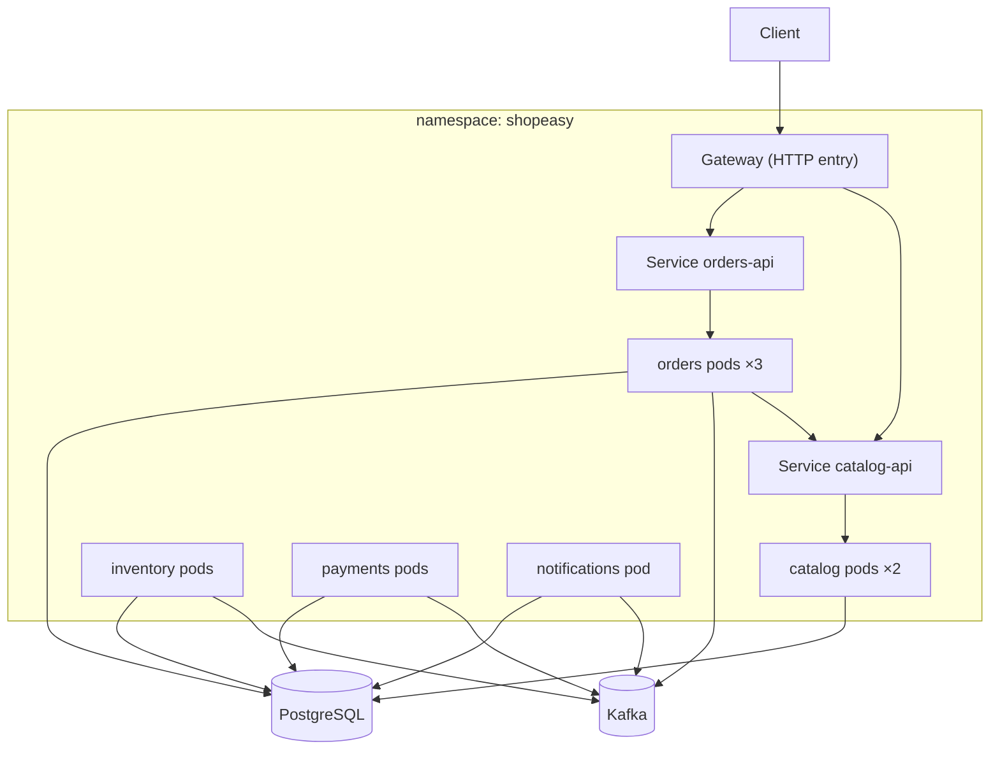

**Chapter 6 of 10: Running ShopEasy on Kubernetes**

In Chapter 5 the full checkout worked in Docker Compose. Compose is great on one laptop, but it can’t spread containers over several machines, replace a crashed node, roll out a new version without downtime, or scale on load. Today we move ShopEasy to **Kubernetes**—first on a **local cluster**, so Chapter 7 only has to change *where* the cluster runs.

**Time:** About 45 minutes. Local cluster only; Azure comes next.

### 1. What Kubernetes adds over Compose

| Need | Docker Compose | Kubernetes |
|---|---|---|
| Multiple machines | No | Schedules pods across nodes |
| Self-healing | Restart policy on one host | Replaces failed pods and pods on failed nodes |
| Zero-downtime release | No | Rolling updates with readiness checks |
| Autoscaling | No | HPA / KEDA scale replicas on metrics |
| Traffic routing | Port mapping | Services, Gateway/Ingress, load balancing |
| Declarative desired state | Partly | Everything, continuously reconciled |

**Core idea:** you declare *what you want* (“3 Orders replicas, version `3f9c2ab`”); controllers keep **reconciling** reality to match it.

**Option to consider:** Azure Container Apps (managed, Kubernetes-based, no cluster to operate). It’s a strong production choice for small teams. We choose Kubernetes/AKS because operating Kubernetes is a learning goal (Chapter 1 ADR).

### 2. Kubernetes objects we use

| Object | Purpose | ShopEasy example |
|---|---|---|
| **Namespace** | Group and isolate resources | `shopeasy` |
| **Deployment** | Desired replicas + rolling updates of a pod template | `orders-api` |
| **Pod** | One or more containers scheduled together | One Orders instance |
| **Service** | Stable DNS name + load balancing to pods | `http://catalog-api` |
| **ConfigMap** | Non-secret configuration | `Services__Catalog` |
| **Secret** | Sensitive configuration | DB passwords (from Key Vault in Chapter 7) |
| **Job** | Run-to-completion task | Database migration |
| **HPA / KEDA ScaledObject** | Autoscaling | Orders on CPU, Inventory on Kafka lag |
| **PodDisruptionBudget** | Keep minimum replicas during maintenance | ≥1 Orders pod always up |
| **NetworkPolicy** | Firewall between pods | Only Orders may call Catalog’s internal API |
| **Gateway + HTTPRoute** | External HTTP entry point | `/api/v1/orders` → `orders-api` |



### 3. Local cluster—options and why

| Option | Strengths | Weaknesses |
|---|---|---|
| **kind** (Kubernetes in Docker) | Fast, multi-node, disposable, same as CI | Needs image loading or local registry |
| Docker Desktop Kubernetes | One checkbox | Single node, less control |
| minikube | Many add-ons | Heavier |
| k3d | Lightweight k3s | Slightly different distribution |

**Choice: kind** with 1 control-plane + 2 worker nodes—we can see pods spread and test node failure. The same setup runs in CI pipelines (Chapter 9).

```bash
kind create cluster --name shopeasy --config deploy/local/kind.yaml
kind load docker-image shopeasy/orders-api:dev --name shopeasy
```

### 4. Where do PostgreSQL and Kafka run?

| Option | Fits when |
|---|---|
| **Managed services** (Azure PostgreSQL Flexible Server, Event Hubs) | Production—backups, patching, HA handled for you |
| Operators in-cluster (CloudNativePG, Strimzi) | Need full control or multi-cloud |
| Plain StatefulSets | Learning only |

**Choice:** in **AKS, managed services** (Chapter 7). **Locally**, the simplest path: keep PostgreSQL and Kafka in **Docker Compose** and let kind pods reach them, or install them with Helm charts in a `shopeasy-infra` namespace. Our services only see connection strings, so nothing in the application changes.

**Rule:** stateless services in Kubernetes; stateful data in managed services whenever possible.

### 5. A complete Deployment—Orders

```yaml
apiVersion: apps/v1
kind: Deployment
metadata:
  name: orders-api
  labels: { app: orders-api, part-of: shopeasy }
spec:
  replicas: 2
  revisionHistoryLimit: 5
  strategy:
    type: RollingUpdate
    rollingUpdate: { maxUnavailable: 0, maxSurge: 1 }   # never drop below desired capacity
  selector:
    matchLabels: { app: orders-api }
  template:
    metadata:
      labels: { app: orders-api, part-of: shopeasy }
    spec:
      serviceAccountName: orders-api
      securityContext:
        runAsNonRoot: true
        seccompProfile: { type: RuntimeDefault }
      containers:
        - name: orders-api
          image: shopeasy/orders-api:3f9c2ab        # commit SHA, never latest
          ports: [{ name: http, containerPort: 8080 }]
          envFrom:
            - configMapRef: { name: orders-api-config }
            - secretRef:    { name: orders-api-secrets }
          resources:
            requests: { cpu: 100m, memory: 192Mi }
            limits:   { memory: 384Mi }
          startupProbe:
            httpGet: { path: /health/live, port: http }
            periodSeconds: 2
            failureThreshold: 30
          livenessProbe:
            httpGet: { path: /health/live, port: http }
            periodSeconds: 10
          readinessProbe:
            httpGet: { path: /health/ready, port: http }
            periodSeconds: 5
          securityContext:
            allowPrivilegeEscalation: false
            readOnlyRootFilesystem: true
            capabilities: { drop: ["ALL"] }
      topologySpreadConstraints:
        - maxSkew: 1
          topologyKey: kubernetes.io/hostname
          whenUnsatisfiable: ScheduleAnyway
          labelSelector: { matchLabels: { app: orders-api } }
```

| Setting | Why |
|---|---|
| `maxUnavailable: 0`, `maxSurge: 1` | New pod must be **ready** before an old one stops—zero-downtime release |
| **startup** probe | Gives slow starts time without making liveness lenient |
| **liveness** = process alive | Failing → container restarted. Must **not** check the DB, or a DB outage restarts every pod |
| **readiness** = can serve now | Failing → removed from Service endpoints, not restarted |
| CPU request, no CPU limit | Requests guarantee scheduling; CPU limits cause throttling/latency |
| Memory limit | Memory can’t be throttled—a leak must not starve the node |
| Spread over nodes | One node failure doesn’t take all replicas |
| `readOnlyRootFilesystem` | Matches the chiseled, non-root image (Chapter 3) |

**Graceful shutdown:** on rollout Kubernetes sends `SIGTERM`. ASP.NET Core stops accepting requests and our Kafka `BackgroundService` finishes the current message and commits—thanks to `CancellationToken` everywhere (Chapter 4). `terminationGracePeriodSeconds` (default 30 s) bounds it.

### 6. Service, configuration, and secrets

```yaml
apiVersion: v1
kind: Service
metadata: { name: catalog-api }
spec:
  selector: { app: catalog-api }
  ports: [{ name: http, port: 80, targetPort: http }]
---
apiVersion: v1
kind: ConfigMap
metadata: { name: orders-api-config }
data:
  ASPNETCORE_ENVIRONMENT: Production
  Services__Catalog: http://catalog-api
  Kafka__BootstrapServers: kafka.shopeasy-infra:9092
```

Same environment variables as Compose (Chapter 3)—**the image doesn’t change, only where config comes from.**

**Secrets—options:**

| Option | Pros | Cons |
|---|---|---|
| Plain Kubernetes Secret (YAML) | Simple | Base64 only; must never be committed |
| Sealed Secrets / SOPS | Encrypted in Git | Key management |
| **Key Vault + Secrets Store CSI driver** | Secrets stay in Azure, rotated centrally | Azure-specific setup |
| **Workload Identity (no secret at all)** | Pod gets an Entra ID token—passwordless DB/Event Hubs | Requires managed services that support Entra auth |

**Choice:** locally, a Secret created from `.env` by a script (never committed). In AKS, **Workload Identity first, Key Vault CSI for anything that still needs a secret** (Chapter 7).

### 7. Migrations as a Job

The migration bundle from Chapter 3 runs as a Kubernetes **Job** before the new version rolls out:

```yaml
apiVersion: batch/v1
kind: Job
metadata: { name: orders-migrate-3f9c2ab }
spec:
  backoffLimit: 2
  ttlSecondsAfterFinished: 3600
  template:
    spec:
      restartPolicy: Never
      containers:
        - name: migrate
          image: shopeasy/orders-migrator:3f9c2ab
          envFrom: [{ secretRef: { name: orders-migrator-secrets } }]  # DDL-capable user
```

**Expand–contract rule:** a migration must work with **both** old and new code, because during a rolling update both run at once. Add columns first; remove old ones in a later release.

### 8. External traffic—options and why

| Option | Notes |
|---|---|
| `Service type: LoadBalancer` per service | One public IP per service—expensive, no routing |
| Ingress (ingress-nginx) | Classic; **ingress-nginx is retired (end of maintenance March 2026)**—don’t start new projects on it |
| **Gateway API** | Official successor to Ingress: role-separated, richer routing (headers, weights, canary) |

**Choice: Gateway API.** Implementation locally: **Envoy Gateway** (or NGINX Gateway Fabric). In AKS: **Application Gateway for Containers** or the AKS-managed Gateway API (Istio-based). The `HTTPRoute`s stay the same.

```yaml
apiVersion: gateway.networking.k8s.io/v1
kind: HTTPRoute
metadata: { name: shopeasy-api }
spec:
  parentRefs: [{ name: shopeasy-gateway }]
  rules:
    - matches: [{ path: { type: PathPrefix, value: /api/v1/products } }]
      backendRefs: [{ name: catalog-api, port: 80 }]
    - matches: [{ path: { type: PathPrefix, value: /api/v1/orders } }]
      backendRefs: [{ name: orders-api, port: 80 }]
```

**Is this our “API Gateway” from Chapter 1?** It covers routing and TLS. Authentication, rate limiting, and request aggregation (YARP vs Azure API Management) are decided in Chapter 10.

**Service mesh—when and why**

A service mesh puts a proxy (sidecar, or node-level in “ambient” mode) next to every pod, so **service-to-service traffic** gets features without code changes.

| Capability | Without mesh (our design) | With mesh (Istio / Linkerd) |
|---|---|---|
| Encryption between pods | Plain HTTP inside cluster + NetworkPolicy | **Automatic mTLS** with identity per workload |
| Retries, timeouts, circuit breaking | In code (Polly, Chapter 2) | In proxy config |
| Traffic splitting / canary between services | Gateway API at the edge only | Any internal route |
| Service-level metrics & traces | OpenTelemetry in code (Chapter 8) | Also from proxies, for every language |
| Authorization between services | NetworkPolicy (IP/label based) | Policies by **workload identity** |
| Cost | — | Control plane, extra latency (~1–3 ms), memory, upgrades, learning curve |

**Adopt a mesh when:** compliance requires mTLS everywhere, many services in **different languages** need identical resilience/telemetry, or fine-grained internal traffic control is needed.
**Skip it when:** few services, one language with good libraries, small team—**our case**.

**AKS option:** the **Istio-based service mesh add-on** (managed upgrades) or Istio **ambient mode** (no sidecars). Interview answer in one line: *“A mesh moves cross-cutting network concerns from code into infrastructure—worth it at scale or for zero-trust mTLS, overhead for a small system.”*

### 9. Autoscaling

| Service | Scale on | Tool | Why |
|---|---|---|---|
| Catalog, Orders (HTTP) | CPU (e.g., 70% of request) | **HPA** | Load is HTTP requests |
| Inventory, Payments, Notifications | **Kafka consumer lag** | **KEDA** | CPU may be low while messages pile up |

```yaml
apiVersion: keda.sh/v1alpha1
kind: ScaledObject
metadata: { name: inventory }
spec:
  scaleTargetRef: { name: inventory-api }
  minReplicaCount: 1
  maxReplicaCount: 6          # = partitions of the topic (Chapter 4)
  triggers:
    - type: kafka
      metadata:
        bootstrapServers: kafka.shopeasy-infra:9092
        consumerGroup: inventory-service
        topic: shopeasy.inventory.commands
        lagThreshold: "50"
```

**Cluster autoscaler** (AKS) adds nodes when pods can’t be scheduled—pod and node scaling work together. KEDA is an **AKS add-on**, so we don’t operate it ourselves.

### 10. Reliability and security guards

```yaml
apiVersion: policy/v1
kind: PodDisruptionBudget
metadata: { name: orders-api }
spec:
  minAvailable: 1
  selector: { matchLabels: { app: orders-api } }
---
apiVersion: networking.k8s.io/v1
kind: NetworkPolicy
metadata: { name: catalog-api-ingress }
spec:
  podSelector: { matchLabels: { app: catalog-api } }
  ingress:
    - from:
        - podSelector: { matchLabels: { app: orders-api } }
        - namespaceSelector: { matchLabels: { name: gateway-system } }
```

| Guard | Protects against |
|---|---|
| PodDisruptionBudget | Node upgrades draining all replicas at once |
| NetworkPolicy (default deny + allow list) | A compromised pod reaching everything |
| Dedicated ServiceAccount per service | Shared identity; needed for Workload Identity |
| Pod Security Admission `restricted` on the namespace | Root or privileged containers sneaking in |
| ResourceQuota / LimitRange | One namespace consuming the whole cluster |

### 11. Packaging manifests—options and why

| Option | Pros | Cons |
|---|---|---|
| Raw YAML | Nothing to learn | Copy-paste per environment |
| **Kustomize** | Built into `kubectl`; base + overlays, plain YAML | No templating logic |
| Helm | Templating, versioned releases, huge chart ecosystem | Go templates get hard to read |

**Choice: Kustomize for our services, Helm for third-party software** (KEDA if not using the add-on, Envoy Gateway, local Kafka/PostgreSQL).

```text
deploy/
  k8s/
    base/
      catalog/   orders/   inventory/   payments/   notifications/
      gateway/   namespace.yaml
    overlays/
      local/     # kind: 1 replica, local images, local Secret
      dev/       # AKS dev: ACR images, Workload Identity, Key Vault
      prod/      # AKS prod: more replicas, PDBs, stricter limits
```

```bash
kubectl apply -k deploy/k8s/overlays/local
```

**How it gets deployed later:** push-based (pipeline runs `kubectl apply`) vs **GitOps** (Argo CD / Flux pulls from Git). Decided in Chapter 9.

### 12. Architecture decisions for this chapter

| Decision | Reason | Tradeoff |
|---|---|---|
| Kubernetes (kind locally, AKS later) | Learning goal; portable | More to operate than Container Apps |
| Stateless services in cluster, data in managed services | Backups/HA handled by Azure | Different local vs cloud setup |
| Startup/liveness/readiness with distinct meanings | Correct restarts and routing | Must design health checks carefully |
| CPU requests without limits; memory limits | Avoid throttling, contain leaks | Needs monitoring of usage |
| Migrations as a Job + expand–contract | Safe rolling updates | Two-step schema changes |
| Gateway API | Successor to Ingress; ingress-nginx retired | Newer; implementations vary |
| HPA for HTTP, KEDA for Kafka lag | Scale on the real bottleneck | Extra component (AKS add-on) |
| Kustomize for our manifests, Helm for third-party | Plain YAML + ecosystem | Two tools |
| Workload Identity + Key Vault for secrets | Passwordless where possible | Azure-specific wiring |

### 13. Run it

```bash
kind create cluster --name shopeasy --config deploy/local/kind.yaml
./deploy/local/load-images.sh             # builds and loads all images into kind
helm install eg oci://docker.io/envoyproxy/gateway-helm -n envoy-gateway-system --create-namespace
kubectl apply -k deploy/k8s/overlays/local
kubectl get pods -n shopeasy -o wide
```

**Done when:**

- All pods are `Running` and `Ready`, spread across both worker nodes.
- `GET /api/v1/products` and `POST /api/v1/orders` work through the Gateway, and an order reaches `Confirmed`.
- `kubectl rollout restart deploy/orders-api` while sending requests in a loop → no failed requests.
- `kubectl delete pod` on an Orders pod → a replacement appears; checkout keeps working.
- Stopping PostgreSQL makes pods **not ready** but does **not** restart them.
- Publishing 1,000 `ReserveStock` messages scales Inventory up via KEDA, then back down.
- A test pod in another namespace cannot reach `catalog-api` (NetworkPolicy).

**What to remember for interviews:**

- Kubernetes is declarative: controllers reconcile actual state to desired state.
- Deployment manages pods; Service gives them a stable name; Gateway/Ingress exposes them.
- Liveness restarts, readiness routes, startup protects slow starts—never check dependencies in liveness.
- Set requests for scheduling; be careful with CPU limits; always limit memory.
- Rolling updates need readiness checks and backward-compatible database changes.
- Keep state in managed services; keep pods stateless and disposable.
- Scale HTTP services on CPU/requests, consumers on queue lag (KEDA).
- Gateway API is the successor to Ingress.
- Security: non-root, read-only FS, NetworkPolicies, one ServiceAccount per service, Workload Identity.

**Next: Chapter 7—Azure and Terraform. Build AKS, ACR, PostgreSQL Flexible Server, Event Hubs, Key Vault, and networking as code, and deploy ShopEasy to Azure.**
