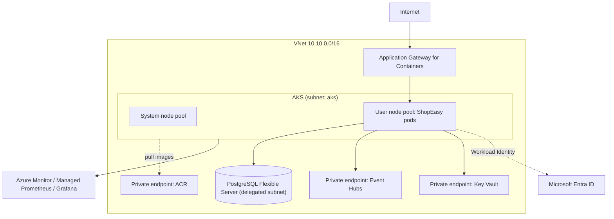

**Chapter 7 of 10: Azure infrastructure with Terraform**

In Chapter 6 ShopEasy ran on a local kind cluster. Today we build the **real environment in Azure**—network, AKS, container registry, PostgreSQL, Event Hubs, Key Vault—**entirely as code**, and deploy the same Kustomize manifests to it.

**Time:** About 50 minutes. Requires an Azure subscription. **Costs money while running**—destroy the dev environment when you finish (§13).

### 1. Why Infrastructure as Code?

Creating resources by clicking in the Azure portal works once. Then:

- Nobody remembers which settings were changed.
- Dev and prod drift apart.
- Rebuilding after a mistake takes days.

| Portal clicks | Infrastructure as Code |
|---|---|
| Undocumented | The code **is** the documentation |
| Hard to repeat | Same code → identical dev, test, prod |
| No review | Changes go through pull requests |
| Drift unnoticed | `plan` shows exactly what differs |
| Slow recovery | Rebuild an environment with one command |

### 2. Choose the IaC tool—options and why

| Option | Strengths | Weaknesses |
|---|---|---|
| **Terraform** (HCL) | Multi-cloud, huge provider ecosystem (Azure, Kubernetes, Helm, Grafana, GitHub), plan/apply, very common in job requirements | You manage state; BSL license (OpenTofu is the open-source fork) |
| Bicep | Azure-native, no state file, day-0 support for new Azure features | Azure only |
| Pulumi | Real languages (C#, TS) | Smaller community, state service |
| ARM templates | Native | Verbose JSON—Bicep replaced it |

**Choice: Terraform** with the `azurerm` provider (v4). It’s the most common IaC tool across clouds, and one tool can also configure Grafana dashboards and GitHub settings later. **Bicep is an equally valid choice for an Azure-only company.**

### 3. Terraform concepts you must know

| Concept | Meaning |
|---|---|
| **Provider** | Plugin that talks to an API (`azurerm`, `azuread`, `helm`) |
| **Resource** | Something Terraform creates and manages |
| **Data source** | Something Terraform only reads |
| **Variable / output** | Inputs and results of a configuration or module |
| **Module** | Reusable group of resources (e.g., `aks`) |
| **State** | Terraform’s record of what it created → maps code to real resources |
| **Plan / apply** | Preview the diff, then execute it |

**Workflow:** `init` → `fmt`/`validate` → `plan` → review → `apply`. In a team, **only the pipeline applies** (Chapter 9).

### 4. State—the most important design decision

The state file contains resource IDs and sometimes **secrets**. Losing it means Terraform no longer knows what it owns.

| Option | Pros | Cons |
|---|---|---|
| Local file | Zero setup | Lost laptop = lost state; no team use |
| **Azure Storage backend** | Encrypted, versioned, **blob lease locking**, Entra ID auth | Must bootstrap the storage account first |
| HCP Terraform / Terraform Cloud | Managed state + runs + policies | External SaaS |

**Choice: Azure Storage** with versioning, soft delete, and Entra ID (no access keys):

```hcl
terraform {
  required_version = ">= 1.9"
  required_providers {
    azurerm = { source = "hashicorp/azurerm", version = "~> 4.0" }
  }
  backend "azurerm" {
    resource_group_name  = "rg-shopeasy-tfstate"
    storage_account_name = "stshopeasytfstate"
    container_name       = "tfstate"
    key                  = "dev.tfstate"
    use_azuread_auth     = true
  }
}
```

The state storage account itself is created once by a small `bootstrap/` configuration (chicken-and-egg problem).

### 5. Repository layout—modules and environments

```text
infrastructure/
  bootstrap/                 # state storage (run once)
  modules/
    network/                 # VNet, subnets, private DNS zones
    aks/                     # cluster, node pools, add-ons, identities
    acr/
    postgres/                # flexible server + 5 databases
    eventhubs/               # namespace + hubs (= Kafka topics)
    keyvault/
    monitoring/              # Log Analytics, Managed Prometheus, Grafana (Chapter 8)
  environments/
    dev/    main.tf  dev.tfvars
    prod/   main.tf  prod.tfvars
```

**Environment isolation—options:**

| Option | Notes |
|---|---|
| Terraform workspaces | Same code, different state—easy to apply to the wrong one |
| **Folder per environment** | Explicit, separate state and backend key, different module versions possible |
| Separate subscriptions per environment | Strongest isolation (billing, RBAC, quotas)—recommended for prod |

**Choice: folder per environment**, dev and prod in **separate subscriptions** when possible.

```hcl
# environments/dev/main.tf
module "network"  { source = "../../modules/network"  ... }
module "aks"      { source = "../../modules/aks"      subnet_id = module.network.aks_subnet_id ... }
module "postgres" { source = "../../modules/postgres" delegated_subnet_id = module.network.db_subnet_id ... }
```

### 6. The Azure architecture



**Core principle: no data service has a public endpoint.** Everything is reachable only inside the VNet, and pods authenticate with **Entra ID**, not passwords.

### 7. Resource choices—options and why

**Region:** choose one close to customers that offers every service we need and availability zones (e.g., West Europe / Germany West Central / Central India). Prod uses **zones**; dev doesn’t, to save cost.

**Networking**

| Decision | Options | Choice |
|---|---|---|
| Pod networking | kubenet (retired), Azure CNI (pod IPs from VNet), **Azure CNI Overlay** | **Overlay**—pods don’t consume VNet IPs |
| Data service access | Public + firewall, service endpoints, **private endpoints** | **Private endpoints / VNet integration** |
| Egress | Load balancer, **NAT Gateway**, Azure Firewall | NAT Gateway in dev; Azure Firewall when egress control is required |

**AKS**

```hcl
resource "azurerm_kubernetes_cluster" "this" {
  name                      = "aks-shopeasy-${var.env}"
  location                  = var.location
  resource_group_name       = var.resource_group_name
  dns_prefix                = "shopeasy-${var.env}"
  kubernetes_version        = var.kubernetes_version
  sku_tier                  = var.env == "prod" ? "Standard" : "Free"
  automatic_upgrade_channel = "patch"
  oidc_issuer_enabled       = true      # required for Workload Identity
  workload_identity_enabled = true
  local_account_disabled    = true      # Entra ID login only
  azure_policy_enabled      = true

  default_node_pool {
    name                         = "system"
    vm_size                      = "Standard_D2ds_v5"
    node_count                   = 2
    vnet_subnet_id               = var.subnet_id
    only_critical_addons_enabled = true   # system pods only
    os_sku                       = "AzureLinux"
  }

  network_profile {
    network_plugin      = "azure"
    network_plugin_mode = "overlay"
    network_policy      = "cilium"
    network_data_plane  = "cilium"
    outbound_type       = "userAssignedNATGateway"
  }

  identity { type = "SystemAssigned" }
  azure_active_directory_role_based_access_control { azure_rbac_enabled = true }
  workload_autoscaler_profile { keda_enabled = true }   # KEDA add-on (Chapter 6)
  monitor_metrics {}                                    # Managed Prometheus (Chapter 8)
}

resource "azurerm_kubernetes_cluster_node_pool" "apps" {
  name                  = "apps"
  kubernetes_cluster_id = azurerm_kubernetes_cluster.this.id
  vm_size               = "Standard_D4ds_v5"
  auto_scaling_enabled  = true
  min_count             = 2
  max_count             = 5
  vnet_subnet_id        = var.subnet_id
  os_sku                = "AzureLinux"
}
```

| Setting | Why |
|---|---|
| Separate system and user pools | App load can’t starve CoreDNS and other system pods |
| Cluster autoscaler on apps pool | Nodes follow pod demand (Chapter 6, §9) |
| OIDC + Workload Identity | Pods get Entra tokens—no secrets for DB/Event Hubs/Key Vault |
| Local accounts disabled, Azure RBAC | Every `kubectl` user is an Entra identity with audited roles |
| Cilium network policy | Enforces our NetworkPolicies efficiently |
| Automatic patch upgrades | Security patches without manual work |

**Option considered: AKS Automatic**—preconfigured best practices, managed node pools. Excellent for production teams; we use AKS Standard so every setting above is visible and learnable.

**Container registry (ACR)**

| Choice | Why |
|---|---|
| SKU Basic (dev) / **Premium** (prod) | Premium needed for private endpoints, geo-replication |
| `admin_enabled = false` | No shared passwords |
| AKS kubelet identity gets **AcrPull** | Pods pull images without image pull secrets |
| CI identity gets **AcrPush** only | Least privilege (Chapter 9) |

**PostgreSQL Flexible Server**

| Choice | Why |
|---|---|
| Burstable B2s (dev) / General Purpose + **zone-redundant HA** (prod) | Cost vs availability |
| VNet integration (delegated subnet) + private DNS zone | No public access |
| **Entra ID authentication** | Each service’s managed identity is a DB role—no passwords |
| 5 databases, 5 roles | Database-per-service ownership (Chapter 1) |
| Backups 7 days (dev) / 35 days + geo-redundant (prod) | Recovery objectives |

**Messaging—final decision from Chapter 4**

| Option | Kafka compatibility | Ops | Cost |
|---|---|---|---|
| **Event Hubs (Standard/Premium), Kafka endpoint** | Kafka clients unchanged; topics = event hubs; consumer groups supported | Fully managed, Entra auth, private endpoint | Low (Standard) |
| Confluent Cloud on Azure | Full Kafka (compaction, Streams, Schema Registry) | Managed by Confluent | Higher |
| Strimzi on AKS | Full Kafka | **We** operate brokers, disks, upgrades | Node cost + effort |

**Choice: Event Hubs Standard (dev) / Premium (prod).** Our code uses plain Kafka producer/consumer features, which Event Hubs supports. **Code change: none—only configuration** (bootstrap `<namespace>.servicebus.windows.net:9093`, SASL OAUTHBEARER with Workload Identity). Each Kafka topic from Chapter 4 becomes an event hub with the same partition count; the `.dlt` topics too.

**Key Vault**

| Choice | Why |
|---|---|
| RBAC authorization model | Same permission system as everything else |
| Purge protection, soft delete | Deleted secrets are recoverable |
| Private endpoint | No public access |
| Holds only what can’t be passwordless | e.g., Notifications provider API key, TLS certificates |

### 8. Identity: one managed identity per service

```hcl
resource "azurerm_user_assigned_identity" "svc" {
  for_each            = toset(["catalog", "orders", "inventory", "payments", "notifications"])
  name                = "id-shopeasy-${each.key}-${var.env}"
  location            = var.location
  resource_group_name = var.resource_group_name
}

resource "azurerm_federated_identity_credential" "svc" {
  for_each            = azurerm_user_assigned_identity.svc
  name                = "aks-${each.key}"
  resource_group_name = var.resource_group_name
  parent_id           = each.value.id
  audience            = ["api://AzureADTokenExchange"]
  issuer              = azurerm_kubernetes_cluster.this.oidc_issuer_url
  subject             = "system:serviceaccount:shopeasy:${each.key}-api"
}
```

| Identity | Gets access to |
|---|---|
| orders | `orders_db`; send to `inventory.commands`, `payments.commands`, `orders.events`; receive its events |
| inventory | `inventory_db`; receive `inventory.commands`; send `inventory.events` |
| notifications | `notifications_db`; receive `orders.events`; read its Key Vault secret |

**Why one identity per service?** Least privilege and auditability: a compromised Catalog pod cannot read the orders database or send payment commands.

The Kubernetes side is one annotation on the ServiceAccount in the `dev`/`prod` Kustomize overlay:

```yaml
metadata:
  name: orders-api
  annotations: { azure.workload.identity/client-id: "<orders identity client id>" }
```

### 9. Where Terraform stops and Kubernetes manifests begin

| Option | Pros | Cons |
|---|---|---|
| Terraform also deploys apps (kubernetes/helm providers) | One tool | App releases tied to infra runs; slow; state bloat |
| **Terraform for platform, Kustomize/GitOps for apps** | Different lifecycles stay separate | Hand-over of outputs (IDs, hostnames) |

**Choice:** Terraform builds the **platform** (Azure resources, identities, cluster add-ons like the Gateway controller). Application manifests are deployed by the pipeline/GitOps (Chapter 9). Terraform **outputs** (identity client IDs, Event Hubs hostname, PostgreSQL host) are written into the overlay’s ConfigMap generator.

**Rule of thumb:** changes weekly or daily → app pipeline. Changes monthly → Terraform.

### 10. Naming, tagging, and governance

| Practice | Example | Why |
|---|---|---|
| Consistent naming (Cloud Adoption Framework) | `aks-shopeasy-dev-weu`, `psql-shopeasy-prod-weu` | Instantly know type, app, env, region |
| Mandatory tags | `app=shopeasy`, `env=dev`, `owner`, `costCenter` | Cost reports and ownership |
| Azure Policy | Deny public IPs on data services; require tags | Guardrails beyond code review |
| Resource locks on prod | `CanNotDelete` on PostgreSQL | Protect against accidental `destroy` |
| `prevent_destroy` lifecycle | On prod databases | Terraform itself refuses to delete |

### 11. Cost awareness (dev environment, rough order)

| Resource | Dev choice | Lever |
|---|---|---|
| AKS | Free tier control plane, 2 small system + 2 app nodes | **Biggest cost**—stop the cluster (`az aks stop`) overnight |
| PostgreSQL | Burstable B2s | Stop server when idle |
| Event Hubs | Standard, 1 throughput unit | Fixed hourly price |
| ACR | Basic | Cheap |
| Log Analytics | Basic logs, short retention | Ingest volume drives cost |

Add an **Azure budget with alerts** in Terraform from day one. Dev environment should be destroyable and recreatable—that’s the IaC test.

### 12. Security and quality checks on Terraform code

| Check | Tool | When |
|---|---|---|
| Formatting & validity | `terraform fmt -check`, `terraform validate` | Every PR |
| Linting | TFLint (azurerm ruleset) | Every PR |
| Security misconfiguration | Checkov / Trivy config | Every PR |
| Plan review | `terraform plan` output posted to the PR | Every PR |
| Drift detection | Scheduled `plan` | Nightly |

### 13. Architecture decisions for this chapter

| Decision | Reason | Tradeoff |
|---|---|---|
| Terraform (azurerm v4) | Multi-cloud, common, extensible | State management; Bicep is simpler for Azure-only |
| Azure Storage backend with Entra auth and locking | Safe team state | Bootstrap step |
| Folder per environment, separate subscriptions | Explicit isolation | Some duplication in `main.tf` |
| Private networking, no public data endpoints | Reduced attack surface | Debugging requires VNet access (Bastion/VPN) |
| AKS Standard, CNI Overlay, Cilium, system/user pools | Learn every setting; scalable network | More decisions than AKS Automatic |
| Workload Identity, one identity per service | Passwordless, least privilege | More identities and role assignments |
| PostgreSQL Flexible Server with Entra auth | Managed, HA, no passwords | Per-server cost |
| Event Hubs Kafka endpoint | Zero code change, fully managed | Fewer Kafka features than Confluent |
| Terraform for platform, pipelines/GitOps for apps | Separate lifecycles | Output hand-over |

### 14. Run it

```bash
az login
cd infrastructure/bootstrap && terraform init && terraform apply
cd ../environments/dev
terraform init
terraform plan  -var-file=dev.tfvars -out=dev.plan
terraform apply dev.plan

az aks get-credentials -g rg-shopeasy-dev -n aks-shopeasy-dev
# push images to ACR (manual now, pipeline in Chapter 9)
az acr build -r acrshopeasydev -t orders-api:$(git rev-parse --short HEAD) -f src/Orders/Orders.Api/Dockerfile .
kubectl apply -k deploy/k8s/overlays/dev

# when finished for the day
terraform destroy -var-file=dev.tfvars
```

**Done when:**

- `terraform plan` on an unchanged environment shows **no changes**.
- All pods run in AKS, pulling images from ACR without pull secrets.
- Services connect to PostgreSQL and Event Hubs **without any password** in config (Workload Identity).
- An order placed through the public Gateway address reaches `Confirmed`.
- PostgreSQL, Event Hubs, Key Vault, and ACR have **no public network access**.
- `terraform destroy` followed by `apply` recreates a working environment.

**What to remember for interviews:**

- IaC makes environments reproducible, reviewable, and recoverable.
- Terraform state is critical: remote, locked, versioned, access-controlled.
- Separate environments by folder/state (and ideally subscription), not just variables.
- Prefer managed PaaS for data; keep it private with private endpoints/VNet integration.
- Workload Identity + managed identities replace secrets; one identity per service.
- AKS: separate system and user node pools, autoscaler, Entra RBAC, automatic patching.
- Event Hubs speaks the Kafka protocol—migrate by configuration, not code.
- Terraform builds the platform; application releases have their own pipeline.
- Guard production with policies, locks, `prevent_destroy`, and budgets.

**Next: Chapter 8—Observability. Logs, metrics, and traces with OpenTelemetry, Prometheus, and Grafana; dashboards, alerts, and following one checkout across all five services.**
