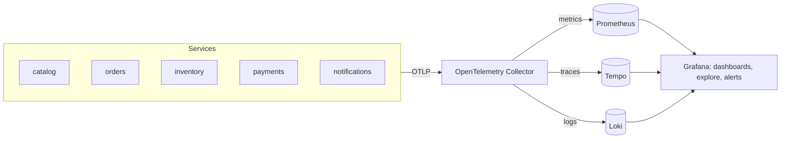

**Chapter 8 of 10: Observability with OpenTelemetry, Prometheus, and Grafana**

In Chapter 7 ShopEasy went live in Azure. Now a customer writes: *“My order has said Pending for 10 minutes.”* Which of the five services is responsible? Which pod? Which message? Today we make the system **explain itself**—with logs, metrics, traces, dashboards, and alerts.

**Time:** About 45 minutes. Works locally (Compose/kind) and in AKS.

### 1. Monitoring vs observability

| | Monitoring | Observability |
|---|---|---|
| Question | “Is it broken?” (known failures) | “**Why** is it broken?” (unknown failures) |
| Approach | Predefined checks and thresholds | Rich telemetry you can query in new ways |
| Example | CPU > 80% alert | “Show slow checkouts for customers paying in EUR since 14:02” |

In a monolith, one log file and a debugger are often enough. In microservices, **one checkout touches five services, three topics, and five databases**—you need telemetry designed for that.

### 2. The three signals

| Signal | Answers | Example | Cost profile |
|---|---|---|---|
| **Metrics** | How much / how often / how fast? | `orders_placed_total`, p95 latency | Cheap, aggregated, long retention |
| **Logs** | What exactly happened here? | “Stock insufficient for product b1f0…” | Detailed, expensive at volume |
| **Traces** | Where did the time go across services? | Checkout span tree: Orders → Kafka → Inventory → … | Detailed per request, sampled |

**They work together:** a metric alert fires → a dashboard shows *which* service → an exemplar links to a **trace** → the trace links to its **logs** via `TraceId`.

### 3. Instrumentation—options and why

| Option | Pros | Cons |
|---|---|---|
| **OpenTelemetry (OTel)** | Vendor-neutral standard for all three signals; built into .NET (`ActivitySource`, `Meter`, `ILogger`) | Collector to run/configure |
| Vendor SDK (Application Insights SDK, Datadog agent) | Quick start with one backend | Lock-in; re-instrument to switch |
| Prometheus client library only | Simple metrics | Metrics only |

**Choice: OpenTelemetry everywhere.** We instrument **once**; the backend is a configuration choice. That’s why `ServiceDefaults` already set it up in Chapter 2.

```csharp
builder.Services.AddOpenTelemetry()
    .ConfigureResource(r => r.AddService(serviceName: "orders-api", serviceVersion: version))
    .WithTracing(t => t
        .AddAspNetCoreInstrumentation()
        .AddHttpClientInstrumentation()
        .AddEntityFrameworkCoreInstrumentation()
        .AddSource("ShopEasy.Messaging"))      // our Kafka producer/consumer spans
    .WithMetrics(m => m
        .AddAspNetCoreInstrumentation()
        .AddHttpClientInstrumentation()
        .AddRuntimeInstrumentation()
        .AddMeter("ShopEasy.Orders"))           // business metrics
    .UseOtlpExporter();                          // send everything to the Collector

builder.Logging.AddOpenTelemetry(o => { o.IncludeScopes = true; o.IncludeFormattedMessage = true; });
```

### 4. The telemetry pipeline



**Why a Collector in the middle?** Services send to one local endpoint; the Collector batches, retries, filters sensitive data, samples traces, adds Kubernetes metadata, and routes to any backend. Changing backends never touches application code.

**Backend options:**

| Option | Metrics | Traces | Logs | Notes |
|---|---|---|---|---|
| **Grafana stack** (Prometheus, Tempo, Loki, Grafana) | ✓ | ✓ | ✓ | Open source; same locally and in Azure |
| **Azure-managed**: Managed Prometheus + Managed Grafana + Application Insights / Log Analytics | ✓ | ✓ | ✓ | Zero ops; Azure-only |
| Commercial (Datadog, New Relic, Grafana Cloud) | ✓ | ✓ | ✓ | Best UX; cost grows with volume |
| Jaeger / Zipkin | – | ✓ | – | Traces only |

**Choice:**

- **Locally:** the Grafana stack in Compose (`grafana/otel-lgtm` image runs all of it in one container).
- **In AKS:** **Azure Monitor managed service for Prometheus + Azure Managed Grafana** for metrics (enabled in Chapter 7), **Application Insights** (OTLP) for traces and logs. Same Grafana dashboards, same PromQL, no Prometheus servers to operate.

The **Collector config** is the only difference between environments.

### 5. Metrics—what to measure

**For every service: RED (requests) and USE (resources)**

| Method | Measures | Example metric |
|---|---|---|
| **R**ate | Requests per second | `http_server_request_duration_seconds_count` |
| **E**rrors | Failed requests | same, `http_response_status_code >= 500` |
| **D**uration | Latency percentiles | `histogram_quantile(0.95, …)` |
| **U**tilization | How busy | CPU, memory vs requests |
| **S**aturation | How overloaded | Thread pool queue, **Kafka consumer lag** |
| **E**rrors | Resource errors | OOMKills, DB connection failures |

**Business metrics—the ones that matter to the shop:**

```csharp
public sealed class OrdersMetrics(IMeterFactory factory)
{
    private readonly Meter _meter = factory.Create("ShopEasy.Orders");
    public Counter<long> Placed    => _meter.CreateCounter<long>("shopeasy.orders.placed");
    public Counter<long> Completed => _meter.CreateCounter<long>("shopeasy.orders.completed"); // tag: outcome, reason
    public Histogram<double> CheckoutDuration =>
        _meter.CreateHistogram<double>("shopeasy.checkout.duration", unit: "s");             // Pending → final
}
```

| Metric | Why it matters |
|---|---|
| Orders placed / confirmed / rejected (by reason) | Revenue health; spike in “insufficient stock” or “card declined” |
| Checkout duration (p50/p95) | Customer experience end to end |
| Orders in non-final state older than 10 min | Stuck sagas (Chapter 5) |
| Outbox unsent count and age | Broker or publisher problem (Chapter 4) |
| Kafka consumer lag per group | Consumers falling behind |
| DLT message count | Poison messages need attention |

**Cardinality warning:** never use `orderId`, `customerId`, or email as a metric label—every unique value creates a new time series and explodes cost. IDs belong in **traces and logs**.

**Prometheus in one paragraph:** a time-series database that **scrapes** (pulls) metrics. In Kubernetes, targets are discovered automatically (ServiceMonitor/PodMonitor or scrape annotations). Queries use **PromQL**:

```promql
# p95 latency of POST /orders over 5 minutes
histogram_quantile(0.95,
  sum by (le) (rate(http_server_request_duration_seconds_bucket{service_name="orders-api", http_route="/api/v1/orders", http_request_method="POST"}[5m])))
```

### 6. Distributed tracing—following one checkout

A **trace** is the whole journey; each step is a **span** with timing, attributes, and parent. HTTP propagation is automatic (`traceparent` header, W3C Trace Context). **Kafka is not**, so we propagate it in message headers:

```csharp
// Producer (outbox publisher): inject current trace context into headers
Propagators.DefaultTextMapPropagator.Inject(
    new PropagationContext(Activity.Current!.Context, Baggage.Current),
    message.Headers, (h, key, value) => h.Add(key, Encoding.UTF8.GetBytes(value)));

// Consumer: extract it and start a child span
var parent = Propagators.DefaultTextMapPropagator.Extract(default, message.Headers, ReadHeader);
using var activity = MessagingSource.StartActivity(
    $"{topic} process", ActivityKind.Consumer, parent.ActivityContext);
activity?.SetTag("messaging.system", "kafka");
activity?.SetTag("messaging.destination.name", topic);
activity?.SetTag("shopeasy.order_id", orderId);
```

**Outbox subtlety:** the outbox row stores the `traceparent` from the original HTTP request, so the publish span—running a second later in a background loop—still joins the **same trace**.

```mermaid
gantt
    dateFormat X
    axisFormat %L ms
    section orders-api
    POST /api/v1/orders          :0, 45
    GET catalog products         :5, 20
    INSERT order + outbox        :25, 40
    section outbox
    publish ReserveStock         :900, 915
    section inventory
    process ReserveStock         :920, 960
    section orders
    process StockReserved        :980, 1000
    section payments
    process ProcessPayment       :1010, 1400
```



One look shows the delay: the outbox poll interval (~900 ms) and the payment simulator (~400 ms).

**Sampling—options:**

| Option | Idea | Tradeoff |
|---|---|---|
| Keep everything | 100% | Expensive at scale |
| Head sampling (e.g., 10%) | Decide at the start | Might drop the one failing request |
| **Tail sampling (Collector)** | Decide after the trace ends: keep all errors and slow traces + 10% of the rest | Collector needs memory to buffer |

**Choice:** 100% locally and in dev; **tail sampling** in prod.

### 7. Logs—structured and correlated

```csharp
logger.LogInformation("Stock reservation failed for order {OrderId}: {Reason}", order.Id, reason);
```

| Practice | Why |
|---|---|
| Structured (message template + properties), JSON output | Query by `OrderId` instead of grep |
| `TraceId`/`SpanId` on every log (automatic with OTel) | Jump from trace to logs and back |
| `CorrelationId` from the message envelope in the log scope | Ties together the whole checkout, even across retries |
| Levels: Information for business events, Warning for handled problems, Error for failures needing action | Alert on errors without noise |
| **Never log** passwords, tokens, card data, full emails | Security and GDPR; Collector can redact as a safety net |
| Log to stdout; don’t write files in containers | Kubernetes/Collector collect stdout |

**Option:** Serilog is popular and still works well; the built-in `ILogger` + OpenTelemetry exporter is enough and avoids a second pipeline.

### 8. Dashboards in Grafana

**Dashboard hierarchy—from business to detail:**

| Dashboard | Panels | Audience |
|---|---|---|
| **ShopEasy overview** | Orders/min, confirmation rate, rejections by reason, checkout p95, stuck orders | Everyone, on-call first look |
| **Service (RED)** per service | Rate, errors, p50/p95/p99, pod count, CPU/memory | Service owners |
| **Messaging** | Consumer lag per group, outbox age, DLT counts, publish rate | On-call |
| **Platform** | Node usage, pod restarts, OOMKills, PostgreSQL connections | Platform engineers |

**Dashboards as code:** JSON in `deploy/observability/dashboards/`, provisioned by Grafana (locally) or by the Terraform Grafana provider (Azure Managed Grafana). No hand-edited production dashboards.

### 9. SLOs and alerts

An **SLI** is a measurement; an **SLO** is the target; the **error budget** is how much failure is allowed.

| SLI | SLO (30 days) |
|---|---|
| `POST /orders` success (non-5xx) | 99.5% |
| `POST /orders` p95 latency | < 500 ms |
| Checkout completes (Pending → final) within 60 s | 99% |
| Notification sent within 5 min of confirmation | 99% |

**Alerting principles:**

| Principle | Example |
|---|---|
| Alert on **symptoms customers feel**, not every cause | “Checkout SLO burning fast”, not “CPU 85%” |
| **Burn-rate** alerts | Page if the 30-day error budget would be gone in 2 days |
| Every page is actionable and has a **runbook** link | “Stuck orders > 20 → see runbooks/stuck-orders.md” |
| Severity routing | Page (on-call) vs ticket (next business day) |

| Alert | Severity |
|---|---|
| Checkout SLO fast burn | Page |
| Outbox oldest unsent message > 2 min | Page |
| Consumer lag growing for 10 min | Page |
| Messages in any DLT | Ticket |
| Pod restarts > 3 in 15 min | Ticket |
| Error budget 50% consumed | Ticket / review |

Alert rules live as code (Prometheus rule groups via Terraform in Azure, YAML locally) and route to e-mail/Teams/PagerDuty through Grafana or Azure Monitor action groups.

### 10. Health checks vs observability

| | Health checks (Chapter 6) | Observability |
|---|---|---|
| Consumer | Kubernetes | Humans and alerting |
| Question | Restart? Route traffic? | Why is it slow/failing? |
| Scope | One pod | Whole system |

Both are needed; neither replaces the other.

### 11. Debugging the “Pending for 10 minutes” order

1. **Overview dashboard:** “stuck orders” panel is rising; confirmation rate dropped.
2. **Messaging dashboard:** `payments-service` consumer lag climbing; others are fine.
3. **Search traces** by `shopeasy.order_id`: trace ends at `publish ProcessPayment`; no consumer span.
4. **Logs** for `payments-api` around that time: `Unauthorized: token audience invalid` after a deployment.
5. **Cause:** a federated identity subject changed in the new ServiceAccount name. Roll back; the sweeper (Chapter 5) and at-least-once delivery complete the waiting orders automatically.

**Five minutes instead of five hours—that’s the return on instrumentation.**

### 12. Local setup

```yaml
  otel-lgtm:
    image: grafana/otel-lgtm:latest     # Collector + Prometheus + Tempo + Loki + Grafana
    ports:
      - "3000:3000"   # Grafana
      - "4317:4317"   # OTLP gRPC
      - "4318:4318"   # OTLP HTTP
```

Each service gets `OTEL_EXPORTER_OTLP_ENDPOINT: http://otel-lgtm:4317` and `OTEL_SERVICE_NAME`. In AKS, the Collector runs as a DaemonSet/Deployment and the same variables point to it.

**Option: .NET Aspire dashboard**—a lightweight OTLP viewer for local dev only. Great for quick feedback; not a production backend.

### 13. Architecture decisions for this chapter

| Decision | Reason | Tradeoff |
|---|---|---|
| OpenTelemetry for all signals | Vendor-neutral; built into .NET | Collector to operate |
| Collector between apps and backends | Sampling, redaction, routing without code changes | Extra component |
| Grafana stack locally; Azure Managed Prometheus/Grafana + App Insights in AKS | Same queries and dashboards; managed in cloud | Two backends to understand |
| Trace context propagated through Kafka headers and outbox | One trace per checkout | Custom propagation code |
| Business metrics alongside RED/USE | Detect problems customers feel | More metrics to design |
| No IDs as metric labels | Control cardinality and cost | Need traces/logs for per-order detail |
| Tail sampling in prod | Keep every error and slow trace | Collector memory |
| SLO burn-rate alerts with runbooks | Fewer, actionable pages | Requires agreed SLOs |
| Dashboards and alerts as code | Reviewable, reproducible | Less ad-hoc editing |

### 14. Run it

```bash
docker compose up -d --build
# place a few orders, including one ending in .13
open http://localhost:3000       # Grafana (Explore → Tempo / Loki / Prometheus)
```

**Done when:**

- One checkout appears as **one trace** spanning Orders, Kafka, Inventory, Payments, and Notifications.
- Clicking a span shows its logs (by `TraceId`); a log line links back to its trace.
- The overview dashboard shows orders placed, confirmation rate, rejection reasons, and checkout p95.
- Stopping Payments raises consumer lag and stuck orders, and fires the corresponding alert.
- No log contains tokens, passwords, or card data; no metric has `orderId` as a label.
- In AKS, the same dashboards work in Azure Managed Grafana.

**What to remember for interviews:**

- Metrics tell you *that* something is wrong, traces *where*, logs *why*.
- OpenTelemetry: instrument once, choose backends by configuration.
- The Collector decouples apps from backends and handles sampling and redaction.
- Propagate trace context through message headers—HTTP does it automatically, Kafka doesn’t.
- Measure RED for services, USE for resources, plus business metrics like checkout success.
- Keep metric label cardinality low; put IDs in traces and logs.
- Alert on SLO burn rate and symptoms, with a runbook for every page.
- Observability is what makes eventual consistency debuggable.

**Next: Chapter 9—CI/CD. Build, test, scan, and push images with GitHub Actions or Azure DevOps; Terraform pipelines; and deploying to AKS with GitOps.**
