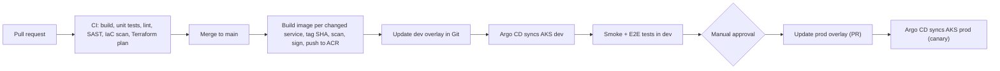
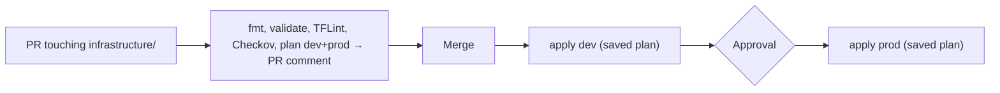

**Chapter 9 of 10: CI/CD—from commit to production**

In Chapter 7 we deployed to Azure by running `az acr build` and `kubectl apply` from a laptop. That doesn’t scale, isn’t audited, and depends on whoever has the right permissions that day. Today we automate the full path: **every commit is built, tested, scanned, packaged, and deployed—safely and repeatably.**

**Time:** About 45 minutes. Uses GitHub (Azure DevOps equivalents noted).

### 1. CI, CD, and CD

| Term | Meaning | ShopEasy |
|---|---|---|
| **Continuous Integration** | Every change is merged often and verified automatically | Build + test + scan on every PR |
| **Continuous Delivery** | Every passing build is **ready** to release; release is a button | Main branch → dev automatically, prod after approval |
| **Continuous Deployment** | Every passing build goes to prod automatically | A later goal, once tests and monitoring earn trust |

**Principle: build once, deploy many.** The image built from commit `3f9c2ab` is the exact image tested in dev and promoted to prod—never rebuilt per environment (Chapter 3).

### 2. The full pipeline



### 3. Choose the CI/CD platform—options and why

| Option | Strengths | Weaknesses |
|---|---|---|
| **GitHub Actions** | Code + CI in one place, huge marketplace, OIDC to Azure, environments with approvals | Complex release orchestration needs conventions |
| Azure DevOps Pipelines | Mature enterprise features, Boards, strong Azure integration, still common in companies | Feature development slower than GitHub |
| GitLab CI | All-in-one DevOps platform | Less common in Azure shops |
| Jenkins | Fully customizable | You operate it; plugin maintenance |

**Choice: GitHub Actions.** **Azure DevOps** concepts map 1:1 (workflow ↔ pipeline, job ↔ job, environment ↔ environment, OIDC ↔ workload identity federation service connection)—worth knowing, as many employers use it.

### 4. Branching and repository strategy

| Option | Notes |
|---|---|
| GitFlow (develop, release, hotfix branches) | Heavy; slows integration |
| **Trunk-based development** | Short-lived branches, PR to `main`, feature flags for unfinished work |

**Choice: trunk-based.** Protected `main`: PR required, CI must pass, 1 review, no direct pushes, CODEOWNERS per service.

**Mono-repo with independent services (Chapter 1):** each service has its **own workflow with path filters**, so changing Inventory doesn’t rebuild Catalog.

```yaml
on:
  pull_request:
    paths: ["src/Orders/**", "src/BuildingBlocks/**", "tests/Orders*/**"]
  push:
    branches: [main]
    paths: ["src/Orders/**", "src/BuildingBlocks/**"]
```

A **reusable workflow** (`.github/workflows/_service.yml`) holds the steps once; five small caller workflows pass the service name.

### 5. CI stage—what runs on every PR

| Step | Tool | Fails the PR when |
|---|---|---|
| Restore & build | `dotnet build -warnaserror` | Compiler errors or warnings |
| Format | `dotnet format --verify-no-changes` | Unformatted code |
| Unit tests | xUnit + coverage | Any failure; coverage drop below threshold |
| Integration tests | Testcontainers (PostgreSQL, Kafka) | Repository/consumer behaviour broken |
| Contract tests | Consumer-driven (e.g., Pact) or schema snapshot tests | Orders’ expectations of Catalog/messages break |
| SAST | CodeQL | High-severity code vulnerabilities |
| Dependencies | Dependabot, `dotnet list package --vulnerable` | Known vulnerable packages |
| Secrets | GitHub secret scanning + push protection | A key or password is committed |
| Dockerfile / manifests | Hadolint, Checkov/Trivy config, `kubeconform` | Insecure or invalid config |
| Terraform | fmt, validate, TFLint, Checkov, **plan posted as PR comment** | Invalid or insecure IaC |

**Speed matters:** cache NuGet packages and Docker layers, run jobs in parallel, keep PR feedback under ~10 minutes. Slow pipelines make developers batch changes—the opposite of CI.

### 6. Authenticating to Azure—no stored secrets

| Option | Risk |
|---|---|
| Service principal client secret in GitHub secrets | Long-lived secret can leak; must be rotated |
| **OIDC federation (workload identity federation)** | GitHub gets a short-lived token per run; nothing stored |

```yaml
permissions:
  id-token: write       # allow requesting the OIDC token
  contents: read

steps:
  - uses: azure/login@v2
    with:
      client-id: ${{ vars.AZURE_CLIENT_ID }}
      tenant-id: ${{ vars.AZURE_TENANT_ID }}
      subscription-id: ${{ vars.AZURE_SUBSCRIPTION_ID }}
```

The federated credential trusts only `repo:org/shopeasy:environment:dev` (or `:prod`). A workflow from a fork or another branch **cannot** obtain the token. Same pattern as Workload Identity for pods (Chapter 7)—one passwordless model everywhere.

**Separate identities:** `ci-images` (AcrPush only), `ci-terraform-dev`, `ci-terraform-prod` (Contributor + User Access Administrator on their own subscription). Least privilege per job.

### 7. Building and publishing images

```yaml
build-image:
  needs: test
  if: github.ref == 'refs/heads/main'
  environment: build
  steps:
    - uses: actions/checkout@v4
    - uses: azure/login@v2
      with: { client-id: ..., tenant-id: ..., subscription-id: ... }
    - run: az acr login --name ${{ vars.ACR_NAME }}
    - uses: docker/setup-buildx-action@v3
    - uses: docker/build-push-action@v6
      with:
        context: .
        file: src/Orders/Orders.Api/Dockerfile
        tags: ${{ vars.ACR_NAME }}.azurecr.io/orders-api:${{ github.sha }}
        push: true
        provenance: true            # build provenance attestation
        sbom: true                  # software bill of materials
        cache-from: type=gha
        cache-to: type=gha,mode=max
    - name: Scan image
      uses: aquasecurity/trivy-action@0.33.1
      with:
        image-ref: ${{ vars.ACR_NAME }}.azurecr.io/orders-api:${{ github.sha }}
        severity: CRITICAL,HIGH
        exit-code: "1"
        ignore-unfixed: true
```

| Practice | Why |
|---|---|
| Tag = commit SHA | Traceable; immutable (Chapter 3) |
| SBOM + provenance | Know exactly what’s inside and how it was built (supply-chain security) |
| Sign images (Notation / cosign) and verify in AKS (Ratify + Azure Policy) | Cluster runs only images built by our pipeline |
| Scan and fail on fixable critical/high CVEs | Vulnerabilities don’t reach production |
| ACR retention policy | Old untagged images cleaned up |
| Pin third-party actions to a version or SHA | A compromised action can’t silently change |

**Migration bundle image** (`orders-migrator`, Chapter 6) is built in the same job with the same tag.

### 8. Deploying to AKS—push vs GitOps

| Option | How | Pros | Cons |
|---|---|---|---|
| Push (pipeline runs `kubectl`/`helm`) | Pipeline has cluster credentials | Simple, familiar | Pipeline needs cluster admin; drift goes unnoticed |
| **GitOps (Argo CD / Flux)** | Agent in cluster pulls desired state from Git | Git = single source of truth; drift auto-corrected; no cluster credentials in CI; rollback = `git revert` | Extra component; two-step flow |

**Choice: GitOps with Argo CD.** (Flux is equally good and is available as an **AKS extension**; Argo CD’s UI is excellent for learning.)

How the pieces connect:

1. CI pushes image `orders-api:3f9c2ab`.
2. CI updates the **dev overlay**: `kustomize edit set image orders-api=…:3f9c2ab` and commits to the deployment config (same repo `deploy/` folder or a separate `shopeasy-gitops` repo).
3. Argo CD sees the change and syncs the cluster—**Job (migration) first**, then the Deployment, using sync waves:

```yaml
metadata:
  annotations:
    argocd.argoproj.io/sync-wave: "-1"     # migration Job runs before the Deployment
    argocd.argoproj.io/hook: PreSync
```

**Separate config repo—option:** keeps deployment history clean and lets prod changes require different reviewers. We start with `deploy/` in the mono-repo and protect `deploy/k8s/overlays/prod/**` with CODEOWNERS.

### 9. Promotion between environments

| Environment | Trigger | Gate |
|---|---|---|
| **dev** | Every merge to `main` | Automated: smoke tests + E2E checkout test |
| **prod** | Promotion PR (copies the tested SHA to the prod overlay) | GitHub environment **required reviewers**, change window, dev tests green |

```yaml
promote-prod:
  needs: e2e-dev
  environment: prod            # pauses for approval
  steps:
    - run: |
        cd deploy/k8s/overlays/prod
        kustomize edit set image orders-api=${ACR}.azurecr.io/orders-api:${GITHUB_SHA}
    - uses: peter-evans/create-pull-request@v7
      with: { title: "Promote orders-api ${{ github.sha }} to prod", branch: promote/orders-api }
```

**Smoke/E2E test in dev:** a small test project places an order through the public Gateway and polls until `Confirmed`—proving HTTP, Kafka/Event Hubs, all five services, and identities work together.

### 10. Progressive delivery and rollback

| Strategy | How | When |
|---|---|---|
| Rolling update (Chapter 6) | Replace pods gradually | Default for every service |
| Blue/green | Two full versions, switch traffic at once | Risky changes; instant rollback; double capacity |
| **Canary** | 10% → 50% → 100% traffic, checking metrics between steps | High-traffic services (Orders) |
| Feature flags | Deploy code dark, enable per user/percentage (Azure App Configuration) | Separate *deploy* from *release* |

**Choice:** rolling for all; **canary for Orders in prod with Argo Rollouts**, using the Gateway API for traffic split and **Prometheus analysis** (Chapter 8): if error rate or p95 worsens, the rollout aborts automatically.

```yaml
strategy:
  canary:
    steps:
      - setWeight: 10
      - analysis: { templates: [{ templateName: orders-error-rate }] }
      - setWeight: 50
      - pause: { duration: 10m }
      - setWeight: 100
```

**Rollback:** `git revert` the promotion commit → Argo CD returns to the previous SHA. Because migrations are **expand–contract** (Chapter 6), old code still works with the new schema. **Databases roll forward, never back.**

### 11. Terraform pipeline



| Rule | Why |
|---|---|
| Only the pipeline applies; humans have read access to prod | Every change is reviewed and logged |
| Apply the **saved plan** file reviewed in the PR | What was approved is exactly what runs |
| `concurrency` group per environment | Two applies never run at once (plus state locking) |
| Nightly `plan` for drift detection | Portal changes are noticed (Chapter 7) |
| Separate workflows for app and infra | Different lifecycles (Chapter 7, §9) |

### 12. Pipeline security—the supply chain

| Threat | Mitigation |
|---|---|
| Leaked cloud credentials | OIDC; no stored secrets |
| Malicious PR from a fork stealing secrets | Fork PRs get no secrets/OIDC; `pull_request_target` avoided |
| Compromised third-party action | Pin versions/SHAs; allow-list actions |
| Tampered image | Sign + verify; deploy only from our ACR (Azure Policy) |
| Vulnerable dependencies | Dependabot PRs, scans that block |
| Over-privileged workflow token | `permissions:` set minimal per job |
| Unreviewed prod change | Branch protection, CODEOWNERS, environment approvals |

### 13. DORA metrics—measuring delivery

| Metric | Measures | Our source |
|---|---|---|
| Deployment frequency | How often we release | Argo CD sync history |
| Lead time for changes | Commit → production | Commit time vs prod sync time |
| Change failure rate | % of deployments causing incidents/rollback | Reverts, aborted canaries |
| Time to restore | Incident → recovered | Alerts (Chapter 8) to resolution |

Small, frequent, automated, observable deployments improve all four at once.

### 14. Architecture decisions for this chapter

| Decision | Reason | Tradeoff |
|---|---|---|
| GitHub Actions (Azure DevOps equivalent) | Code and CI together, OIDC, environments | Some conventions to design |
| Trunk-based, protected `main`, path-filtered workflows | Fast integration; independent service builds | Needs good tests and feature flags |
| Build once, tag SHA, promote the same image | What was tested is what runs | Config must be fully external |
| OIDC to Azure, least-privilege identities | No stored secrets | Federated credentials to manage |
| Scan, SBOM, sign, verify | Supply-chain security | Longer pipeline; occasional CVE triage |
| GitOps with Argo CD | Git as truth, drift correction, easy rollback | Extra component, two-step flow |
| Canary for Orders with automated analysis | Limit blast radius | Argo Rollouts + good metrics required |
| Terraform: plan in PR, apply saved plan from pipeline | Reviewed, auditable infra changes | Slower than local apply |

### 15. Run it

```bash
# one-time setup
terraform apply   # in infrastructure/ci: federated identities, role assignments, GitHub environments
helm install argocd argo/argo-cd -n argocd --create-namespace
kubectl apply -f deploy/argocd/shopeasy-dev.yaml     # Argo CD Application → deploy/k8s/overlays/dev

# daily
git checkout -b feature/order-note && git commit -am "Add order note" && git push
# open PR → CI runs → merge → dev deploys automatically → approve prod promotion
```

**Done when:**

- A PR changing only Orders runs only Orders’ CI, and posts test results and a Terraform plan (if infra changed).
- A committed fake secret is blocked by push protection.
- An image with a critical fixable CVE fails the pipeline.
- Merging to `main` deploys to dev within minutes without anyone running `kubectl`.
- The E2E test in dev places an order and sees `Confirmed`.
- Prod deployment waits for approval, then rolls out Orders as a canary.
- A deliberately broken Orders version (high error rate) aborts its canary automatically.
- `git revert` of a promotion restores the previous version in prod.
- No Azure secret is stored in GitHub.

**What to remember for interviews:**

- CI verifies every change; Continuous Delivery keeps every build releasable.
- Build once, promote the same immutable image through environments.
- Use OIDC federation instead of stored cloud credentials.
- Shift security left: SAST, dependency, secret, image, and IaC scanning in the PR.
- GitOps makes Git the source of truth and rollback a `git revert`.
- Separate deploy from release: canaries and feature flags reduce risk.
- Databases roll forward; expand–contract keeps rollbacks safe.
- Terraform changes are planned in PRs and applied only by the pipeline.
- Measure delivery with DORA metrics.

**Next: Chapter 10—Production readiness. API gateway and authentication (Entra ID, YARP vs API Management), rate limiting, resilience testing, scaling, cost, disaster recovery, and the final architecture review.**
