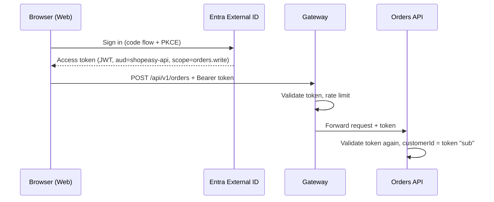
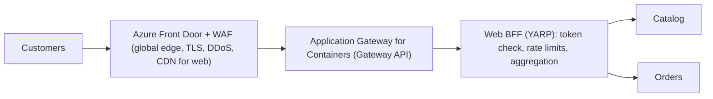
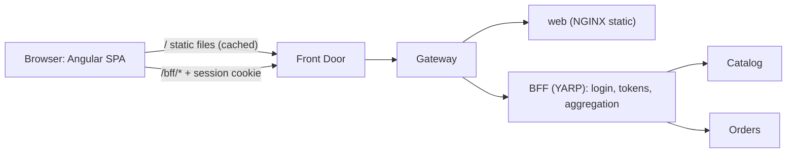
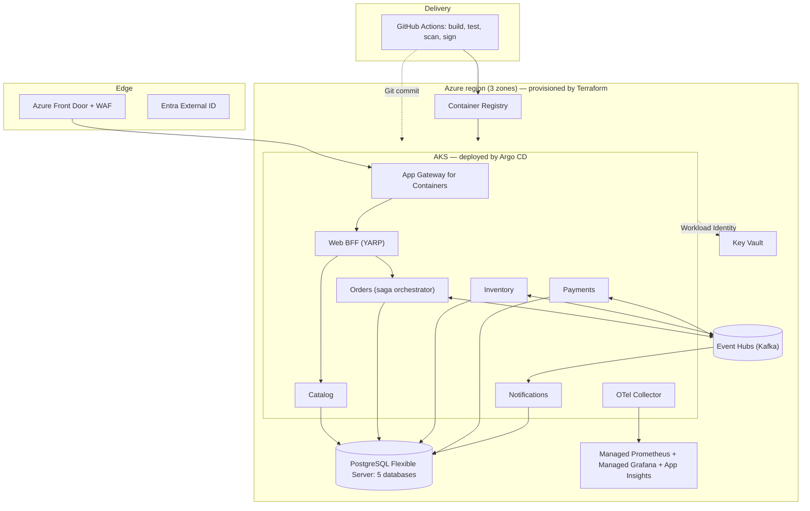

**Chapter 10 of 10: Production readiness and the final architecture**

ShopEasy now builds, deploys, scales, and explains itself. But is it ready for **real customers**? Today we close the remaining gaps—**authentication, the API gateway, rate limiting, resilience testing, disaster recovery, and cost**—and finish with the complete architecture and a review checklist.

**Time:** About 50 minutes. After this chapter: real implementation.

### 1. What “production ready” means

| Question | Covered in |
|---|---|
| Does it do the right thing? | Chapters 1, 2, 5 |
| Does it survive failures and duplicates? | Chapters 4, 5 |
| Can we deploy safely and often? | Chapters 3, 6, 9 |
| Can we see what’s happening? | Chapter 8 |
| **Who is allowed to do what?** | **This chapter** |
| **What happens under abuse or overload?** | **This chapter** |
| **What if a zone or region fails?** | **This chapter** |
| **Can we afford it?** | **This chapter** |

### 2. Authentication—options and why

Until now Orders used a fixed development customer (Chapter 2). Real customers need sign-up, login, and tokens.

| Option | Fits when | Notes |
|---|---|---|
| **Microsoft Entra External ID** | Customer-facing apps on Azure | Managed sign-up/sign-in, social logins, MFA; successor to Azure AD B2C for new projects |
| Keycloak / Duende IdentityServer | Self-hosted, full control | You operate and secure it |
| Auth0 / Okta | Best developer experience | Cost per active user |
| Own username/password tables | Never | Security risk, compliance burden |

**Choice: Entra External ID** for customers, **Entra ID (workforce)** for staff and admin tools. Protocol: **OpenID Connect + OAuth 2.0**, authorization code flow with **PKCE** for the web frontend.



**Validate in every service, not only at the gateway** (zero trust). If something inside the cluster is compromised, services still refuse unauthenticated calls:

```csharp
builder.Services.AddAuthentication().AddJwtBearer(o =>
{
    o.Authority = builder.Configuration["Auth:Authority"];
    o.Audience  = "api://shopeasy";
});
builder.Services.AddAuthorizationBuilder()
    .AddPolicy("orders.write", p => p.RequireScope("orders.write"))
    .AddPolicy("catalog.admin", p => p.RequireRole("CatalogAdmin"));
```

| Authorization rule | Where |
|---|---|
| Customer reads only own orders | Orders: `order.CustomerId == user.sub`, else **404** (don’t reveal existence) |
| Only admins change prices/stock | Catalog/Inventory admin endpoints, role policy |
| Service-to-service HTTP (Orders → Catalog) | Workload Identity token (client credentials) or internal-only route + NetworkPolicy |

**Messages are trusted by network and identity** (only the Orders identity may send to `payments.commands`—Chapter 7), not by user tokens.

### 3. The API gateway—options and why

Chapter 1 drew an “API Gateway”; Chapter 6 gave us Gateway API routing. What else should sit at the edge?

| Responsibility | Example |
|---|---|
| Routing | `/api/v1/orders` → Orders |
| TLS termination | HTTPS certificates |
| Token validation | Reject invalid tokens early |
| Rate limiting / quotas | 10 checkouts per minute per customer |
| Request aggregation (BFF) | One call returns order + product details for the UI |
| Web application firewall | Block SQL injection, bots |

| Option | Strengths | Weaknesses |
|---|---|---|
| Gateway API controller only (Chapter 6) | Already there; routing, TLS, canary | Limited auth and rate limiting |
| **YARP (in-cluster .NET reverse proxy)** | C# code, full control, great for **BFF** | We build and operate policies |
| **Azure API Management** | Policies, developer portal, products/subscriptions, analytics | Cost (Premium for VNet), extra latency hop |
| Azure Front Door + WAF | Global edge, CDN, DDoS, WAF | Not an API management tool |

**Choice—layered:**



- **Front Door + WAF** at the edge (security, global performance).
- **YARP BFF** for the web app—tailored endpoints, token handling, rate limiting in C#.
- **API Management** is the right addition **when external partners consume our APIs** (keys, quotas, developer portal). Not needed for our own frontend yet.

**BFF pattern:** the browser talks only to the BFF; the BFF can keep tokens server-side (cookie session), which is more secure than storing tokens in the browser.

### 3a. The frontend—options and why

The UI is not the focus of this course, but it must be decided deliberately: it drives authentication, the BFF, and deployment.

**Framework**

| Option | Strengths | Weaknesses |
|---|---|---|
| **Angular + TypeScript** | Complete framework (routing, forms, HTTP, DI, testing) out of the box; very common with .NET backends in enterprises; structure feels familiar to C# developers (DI, services, strong typing) | Larger concept surface (RxJS, signals, modules/standalone) |
| React + TypeScript (Vite) | Most popular UI library, huge ecosystem, minimal core | You choose routing, forms, data fetching yourself |
| Blazor (Web App / WebAssembly) | C# end to end, share validation code, one toolchain | Smaller ecosystem; larger WASM download |
| None (Swagger/curl only) | Zero effort | Can’t demonstrate login, BFF, or the customer flow |

**Choice: Angular + TypeScript** (current version, standalone components, signals, Angular CLI), kept deliberately small: product list, cart (in browser state—Chapter 1), checkout, order history with polling of order status. Angular’s built-in DI, `HttpClient`, interceptors, and router mean almost no extra libraries. **React or Blazor would work equally well**—the backend design doesn’t change.

**Angular application structure**

```text
src/Web/shopeasy-web/
  src/app/
    core/            # services: ProductsApi, OrdersApi, AuthService; HTTP interceptors
    features/
      products/      # product list page
      cart/          # cart (signal-based store, kept in sessionStorage)
      checkout/      # checkout page, places order with idempotency key
      orders/        # order history + order status page (polling)
    shared/          # UI components, pipes (currency, status badge)
    app.routes.ts    # lazy-loaded feature routes
    app.config.ts    # provideHttpClient(withInterceptors([...])), provideRouter(...)
  public/config.json # runtime configuration (replaced per environment)
```

| Angular concept | ShopEasy use | Why |
|---|---|---|
| Standalone components + lazy routes | One route per feature | Small initial bundle, no NgModules |
| **Signals** | Cart state, current user | Simple reactive state without an extra store library |
| `HttpClient` + **functional interceptors** | Add anti-forgery header, `traceparent`, handle `401` → login | Cross-cutting HTTP logic in one place |
| **RxJS** `timer` + `switchMap` + `takeWhile` | Poll order status until `Confirmed`/`Rejected` | Cancels cleanly when leaving the page |
| Reactive forms | Checkout form | Typed validation |
| Route guards | `/orders` requires login | Redirect to BFF login |
| Environment via runtime `config.json` (loaded with `provideAppInitializer`) | BFF base URL, telemetry settings | Build once, deploy many—not `environment.prod.ts` |

**Polling order status:**

```typescript
orderStatus$ = (id: string) =>
  timer(0, 2000).pipe(
    switchMap(() => this.http.get<OrderDto>(`/bff/api/v1/orders/${id}`)),
    takeWhile(o => o.status === 'Pending' || o.status === 'AwaitingPayment' || o.status === 'ReleasingStock', true)
  );
```

**Checkout with idempotency key:**

```typescript
placeOrder(items: CartItem[]) {
  this.checkoutKey ??= crypto.randomUUID();              // reused on retry of the same attempt
  return this.http.post<PlaceOrderResponse>('/bff/api/v1/orders',
    { items: items.map(i => ({ productId: i.productId, quantity: i.quantity })) },  // no prices sent
    { headers: { 'Idempotency-Key': this.checkoutKey } });
}
```

**Hosting**

| Option | Pros | Cons |
|---|---|---|
| Azure Static Web Apps | Global CDN, free tier, PR preview environments | Separate domain/pipeline from the API unless routed via Front Door |
| Storage static website + Front Door | Cheap, CDN | Manual routing/caching rules |
| **Container in AKS (static files, unprivileged NGINX) behind the same Gateway, cached by Front Door** | Same domain as BFF → secure cookie sessions; same pipeline, GitOps, and observability as every service | Uses cluster resources (tiny) |

**Choice: container in AKS** behind Front Door. Same domain (`shop.example.com` → web, `/bff/*` → BFF) means the **BFF can use an HttpOnly session cookie**—the browser never holds access tokens. Front Door caches the static files at the edge, so cost and latency are the same as a CDN.



| Frontend concern | Design |
|---|---|
| Login | BFF performs the OIDC code flow; SPA calls `/bff/login`, `/bff/user` |
| CSRF | SameSite cookies + anti-forgery header required by the BFF |
| Order status after checkout | Poll `GET /orders/{id}` every 2 s (option later: SignalR / Azure Web PubSub push on `OrderConfirmed`) |
| Idempotency key | SPA generates one per checkout attempt and reuses it on retry (Chapter 2) |
| Configuration | Runtime `config.json` served by the container—build once, deploy many (Chapter 3) |
| Telemetry | OpenTelemetry Web SDK or Application Insights JS; `traceparent` sent to the BFF, so a trace starts **in the browser** (Chapter 8) |
| Build | `ng build` (production config) → static files copied into an unprivileged NGINX image (multi-stage Dockerfile: Node build stage → NGINX runtime, Chapter 3) |
| Tests | Unit/component tests with the Angular CLI test runner (`ng test`), a Playwright end-to-end checkout test in the dev pipeline (Chapter 9) |
| Code quality | ESLint (`angular-eslint`), Prettier, strict TypeScript (`strict: true`) in CI |

### 4. Rate limiting and overload protection

| Layer | Mechanism | Purpose |
|---|---|---|
| Edge (Front Door WAF) | Rate rules per IP | Bots, brute force |
| BFF (ASP.NET Core `AddRateLimiter`) | Per customer: token bucket | Fair use, e.g., checkout 10/min |
| Services | Concurrency limiter, request timeouts | Protect DB connection pool |
| Messaging | Kafka buffers; KEDA scales consumers | Absorb spikes instead of failing |

```csharp
builder.Services.AddRateLimiter(o =>
{
    o.RejectionStatusCode = StatusCodes.Status429TooManyRequests;
    o.AddPolicy("checkout", ctx => RateLimitPartition.GetTokenBucketLimiter(
        ctx.User.FindFirst("sub")?.Value ?? ctx.Connection.RemoteIpAddress?.ToString() ?? "anon",
        _ => new TokenBucketRateLimiterOptions
        {
            TokenLimit = 10, TokensPerPeriod = 10, ReplenishmentPeriod = TimeSpan.FromMinutes(1)
        }));
});
```

**Graceful degradation:** if Catalog is down, the product page can show cached data; if Notifications is down, checkout continues (Chapter 5). Decide **per dependency** what “degraded” means.

**Caching option:** Azure Managed Redis for Catalog product lists and BFF responses (`HybridCache` in .NET). Add it when metrics show Catalog is a hotspot—not before.

### 5. Resilience—prove it, don’t assume it

We designed for failures in every chapter. Now we **test** them.

| Experiment | Expected result (hypothesis) |
|---|---|
| Kill 1 Orders pod during load | No failed requests (readiness + retries) |
| Stop Inventory for 5 min | Orders accepted, `Pending`; complete after recovery |
| Add 2 s latency to Catalog | Orders’ timeout/circuit breaker trips; clear 503, no thread pile-up |
| Event Hubs throttling | Outbox grows, alert fires, drains afterwards |
| Drain an AKS node | PDB keeps capacity; no downtime |
| Duplicate every Kafka message | No double reservations or charges |
| Zone failure (prod) | Pods and PostgreSQL HA fail over |

**Tools:** **Azure Chaos Studio** (AKS faults via Chaos Mesh, VM/zone faults), Chaos Mesh locally, **Azure Load Testing** / k6 for load.

**Load test targets:** e.g., 50 checkouts/s for 30 min, p95 < 500 ms, error rate < 0.5%, and **find the breaking point**—know which component fails first (usually the DB connection pool).

### 6. Data protection and compliance

| Concern | Measure |
|---|---|
| Encryption in transit | TLS everywhere; TLS to PostgreSQL and Event Hubs enforced |
| Encryption at rest | Azure default (platform keys); customer-managed keys if required |
| Personal data (GDPR) | Minimize (Orders stores customerId, not addresses unless needed); retention policy; delete/anonymize on request across all services via a `CustomerDeleted` event |
| Payment data | Never stored—provider tokens only (PCI scope reduced) |
| Secrets | Workload Identity, Key Vault, rotation |
| Audit | Azure activity logs, AKS audit logs, Entra sign-in logs → Log Analytics |
| Security posture | **Microsoft Defender for Cloud** (Containers, Databases, Key Vault): vulnerability and runtime threat detection |

### 7. Availability and disaster recovery

**Define targets first:**

| Term | Meaning | ShopEasy target |
|---|---|---|
| **RTO** | Max time to restore service | 1 hour |
| **RPO** | Max data loss | 5 minutes |
| Availability SLO | Uptime per month | 99.9% (~43 min downtime) |

**Options:**

| Strategy | RTO / RPO | Cost |
|---|---|---|
| **Zone redundancy in one region** | Minutes / ~0 for zone failure | Moderate |
| Backup & restore to another region | Hours / backup interval | Low |
| **Warm standby** (second region, scaled down) | < 1 h / minutes | Medium–high |
| Active–active multi-region | Seconds / ~0 | Highest; hard with sagas & consistency |

**Choice:**

- **Zone-redundant** primary region: AKS across 3 zones, PostgreSQL zone-redundant HA, Event Hubs Premium (zone-redundant).
- **Regional DR:** PostgreSQL **geo-redundant backup or read replica** in the paired region; Event Hubs **geo-replication**; ACR geo-replication; **Terraform recreates AKS** in the second region; Argo CD re-syncs apps; Front Door switches traffic.
- **Active–active is not worth it** for us—cross-region sagas and inventory consistency would add enormous complexity.

**DR is only real if it’s rehearsed:** run a failover drill twice a year and measure actual RTO/RPO. IaC (Chapter 7) + GitOps (Chapter 9) are what make a 1-hour RTO achievable.

### 8. Scaling plan

| Component | Scales by | Limit to watch |
|---|---|---|
| Catalog, Orders, BFF | HPA on CPU/RPS | DB connections (use pooling; PgBouncer built into Flexible Server) |
| Consumers | KEDA on lag | Partition count (Chapter 4) |
| Nodes | Cluster autoscaler | Subscription vCPU quota, subnet size |
| PostgreSQL | Scale up compute; read replicas for read-heavy Catalog | Write throughput of one primary |
| Event Hubs | Throughput/processing units | Partitions fixed at creation (Standard) |

**Biggest future lever:** Catalog reads are ~95% of traffic → cache + CDN, long before splitting databases further.

### 9. Cost—rough monthly picture (prod, single region + DR)

| Area | Main driver | Optimization |
|---|---|---|
| AKS nodes | VM count and size | Right-size requests, autoscaler, reserved instances / savings plan, spot pool for non-critical workloads |
| PostgreSQL | vCores + HA replica | Reserved capacity; burstable for dev |
| Event Hubs | Tier/units | Standard where Premium features aren’t needed |
| Observability | Log ingestion volume | Sampling, Basic logs, short retention, drop noisy logs at the Collector |
| Networking | Front Door, egress, private endpoints | Cache at edge |

**FinOps habits:** tags per service (Chapter 7), budgets and alerts, monthly cost review per service, dev environments **stopped or destroyed** when idle. Cost per order is a useful business metric.

### 10. Operational readiness

| Item | Why |
|---|---|
| **Runbooks** for every page alert (Chapter 8) | On-call can act at 3 a.m. |
| On-call rotation and escalation | Someone owns incidents |
| **Incident process** + blameless postmortems | Learn from failures |
| Dead-letter replay tool | Fix and reprocess poison messages safely |
| Admin reconciliation endpoints (stuck orders, refunds) | Manual recovery without SQL in prod |
| Dependency update cadence (.NET, AKS, base images) | Stay supported and patched |
| Architecture Decision Records in `docs/adr/` | Future team understands *why* |

### 11. The final architecture



**Technology map—everything from your requirement list:**

| Area | Choice | Chapter | Main alternative |
|---|---|---|---|
| Framework | ASP.NET Core .NET 10, Minimal APIs | 2 | Spring Boot, Node |
| Frontend | Angular + TypeScript in AKS behind Front Door, cookie session via BFF | 10 | React, Blazor, Static Web Apps |
| Service structure | Clean Architecture sized to complexity | 2 | Vertical slices |
| Data | PostgreSQL, database per service, EF Core | 2, 7 | Azure SQL, Cosmos DB |
| Containers | Multi-stage Dockerfile, chiseled non-root images | 3 | SDK container build |
| Local system | Docker Compose → kind | 3, 6 | Aspire, minikube |
| Communication | REST for queries, Kafka for workflow | 1, 4 | gRPC, Service Bus |
| Reliability | Outbox, inbox, idempotency, saga, timeouts | 4, 5 | MassTransit, Temporal |
| Orchestration | Kubernetes / AKS, Gateway API, KEDA | 6, 7 | Container Apps |
| Infrastructure | Terraform, Azure Storage state | 7 | Bicep |
| Identity | Workload Identity, Entra External ID | 7, 10 | Keycloak, Auth0 |
| Observability | OpenTelemetry, Prometheus, Grafana | 8 | App Insights only, Datadog |
| CI/CD | GitHub Actions + Argo CD (GitOps), canary | 9 | Azure DevOps, Flux |
| Edge | Front Door + WAF, YARP BFF | 10 | API Management |

### 12. Production readiness checklist

| ✓ | Item |
|---|---|
| ☐ | Every service: health probes, resource requests/limits, PDB, NetworkPolicy, non-root |
| ☐ | Tokens validated in every service; customers see only their own data |
| ☐ | Rate limits at edge and BFF; timeouts and circuit breakers on every call |
| ☐ | Idempotency for HTTP commands and every message consumer |
| ☐ | Outbox monitored; DLTs monitored with a replay tool |
| ☐ | Dashboards, SLOs, burn-rate alerts, runbooks |
| ☐ | Load test passed at 2× expected peak; breaking point known |
| ☐ | Chaos experiments passed (pod, dependency, node, zone) |
| ☐ | Backups tested by restoring; DR drill done with measured RTO/RPO |
| ☐ | No secrets in Git, images, or pipelines; Defender for Cloud enabled |
| ☐ | Images scanned, signed, verified; dependencies updated |
| ☐ | Budgets and cost alerts per environment |
| ☐ | ADRs written for major decisions |

### 13. Architecture decisions for this chapter

| Decision | Reason | Tradeoff |
|---|---|---|
| Entra External ID + OIDC/PKCE | Managed identity platform, MFA, social login | Azure-specific identity |
| Validate tokens in every service | Zero trust | Small overhead per request |
| Front Door + WAF, YARP BFF; APIM only for partners | Security at edge, flexibility in code | BFF to maintain |
| Layered rate limiting | Protect from abuse and overload | Limits must be tuned |
| Chaos + load testing before go-live | Verified, not assumed, resilience | Time and test environments |
| Zone redundancy + warm-standby DR, not active–active | Meets RTO 1 h / RPO 5 min at reasonable cost | Regional failover is not instant |
| FinOps from day one | Cost visible per service | Discipline required |

### 14. Interview-ready summary—the whole course

- **Design:** requirements first; services around business capabilities; each owns its data (Ch. 1).
- **Code:** dependencies point inward; domain enforces invariants; never trust client prices (Ch. 2).
- **Containers:** multi-stage, minimal, non-root; build once, configure per environment (Ch. 3).
- **Messaging:** commands vs events; outbox for reliability; at-least-once + idempotent consumers (Ch. 4).
- **Workflows:** orchestrated saga with compensation and timeouts; atomic stock updates (Ch. 5).
- **Kubernetes:** probes with distinct meanings; rolling updates; HPA/KEDA; stateless pods (Ch. 6).
- **Azure + Terraform:** remote state; private networking; managed data services; Workload Identity (Ch. 7).
- **Observability:** OpenTelemetry; RED + business metrics; traces across Kafka; SLO alerts (Ch. 8).
- **CI/CD:** OIDC, scanning, signing; GitOps; canary; databases roll forward (Ch. 9).
- **Production:** zero-trust auth; edge security; chaos and load tests; DR with real RTO/RPO; cost control (Ch. 10).

**Every choice has a tradeoff—an architect’s job is to make it consciously and write it down.**

**Next: Appendix—glossary, architecture documentation (C4 + ADRs), interview questions, and the phased implementation roadmap.**
