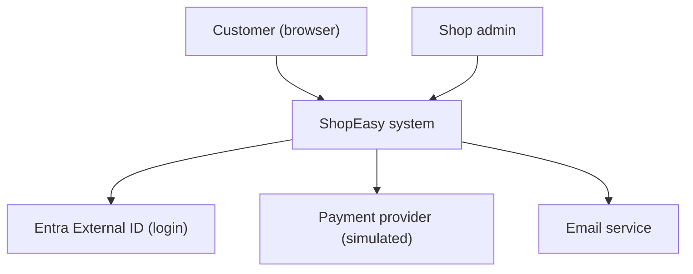
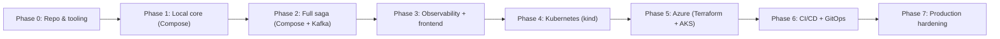

**Appendix: Glossary, architecture documentation, interview questions, and implementation roadmap**

The 10 chapters explained **what** we build and **why**. This appendix collects everything you need **to explain it** (glossary, documentation, interview answers) and **to build it** (a phased roadmap with demos and costs).

---

## Part A — Glossary

| Term | Meaning | Chapter |
|---|---|---|
| **ADR** | Architecture Decision Record: decision, reason, consequences | 1 |
| **Aggregate** | Cluster of objects changed only through one root (`Order`) that enforces invariants | 2 |
| **At-least-once delivery** | Every message arrives, possibly more than once | 4 |
| **BFF** | Backend for Frontend: an API shaped for one UI | 10 |
| **Bounded context / service boundary** | Area where a model and its rules apply; basis for a service | 1 |
| **Burn rate** | How fast the error budget is being consumed | 8 |
| **Canary release** | New version gets a small share of traffic first | 9 |
| **Cardinality** | Number of unique label combinations of a metric | 8 |
| **CDC** | Change Data Capture: read DB changes from its log (Debezium) | 4 |
| **Choreography** | Services react to each other’s events; no coordinator | 5 |
| **Circuit breaker** | Stops calling a failing dependency for a while | 2 |
| **Command / Event** | “Do this” to one owner / “This happened” to anyone | 4 |
| **Compensating action** | New operation that reverses a business effect (release stock) | 1, 5 |
| **Consumer group / lag** | Replicas sharing partitions / messages not yet processed | 4 |
| **Correlation ID** | ID tying all messages and logs of one business flow | 4, 8 |
| **CQRS** | Separate write model from read models | 5 |
| **Dead-letter topic (DLT)** | Where unprocessable messages go | 4 |
| **DORA metrics** | Deployment frequency, lead time, change failure rate, time to restore | 9 |
| **Drift** | Real infrastructure differs from code | 7 |
| **Error budget** | Allowed unreliability = 100% − SLO | 8 |
| **Expand–contract** | Change schemas/contracts in backward-compatible steps | 6, 4 |
| **GitOps** | Cluster pulls desired state from Git (Argo CD, Flux) | 9 |
| **HPA / KEDA** | Kubernetes autoscaling on CPU / on event sources like Kafka lag | 6 |
| **Idempotency** | Repeating an operation has the same effect as doing it once | 1, 2, 4 |
| **Inbox** | Table of processed message IDs to skip duplicates | 4 |
| **Liveness / readiness / startup probe** | Restart? / Route traffic? / Still starting? | 6 |
| **Managed identity / Workload Identity** | Azure identity without secrets / bound to a Kubernetes ServiceAccount | 7 |
| **mTLS** | Both sides of a connection prove identity with certificates | 6 |
| **OIDC / OAuth 2.0 / PKCE** | Login protocol / authorization delegation / protection for public clients | 9, 10 |
| **OpenTelemetry (OTel)** | Vendor-neutral standard for traces, metrics, logs | 8 |
| **Outbox** | Store messages in the same DB transaction as business data | 4 |
| **Partition / offset** | Ordered slice of a Kafka topic / position in it | 4 |
| **PDB** | PodDisruptionBudget: minimum pods kept during maintenance | 6 |
| **Projection / read model** | Denormalized data built from events for queries | 5 |
| **RED / USE** | Rate-Errors-Duration (services) / Utilization-Saturation-Errors (resources) | 8 |
| **RTO / RPO** | Max time to recover / max data loss | 10 |
| **Saga (orchestrated)** | Multi-service workflow of local transactions + compensations, with a coordinator | 5 |
| **SBOM** | Software Bill of Materials: list of everything in an image | 9 |
| **SLI / SLO** | Measured indicator / target for it | 8 |
| **Span / trace** | One timed operation / the tree of spans for one request | 8 |
| **Terraform state** | Terraform’s map from code to real resources | 7 |
| **Tolerant reader** | Consumer that ignores unknown fields and handles missing optional ones | 4 |
| **Zero trust** | Never trust the network; authenticate every call | 10 |

---

## Part B — Architecture documentation

Chapters contain decision **tables**. A real repository needs living documents a new team member can find.

### B1. C4 model—four zoom levels

| Level | Shows | ShopEasy file |
|---|---|---|
| 1. **Context** | System + users + external systems | `docs/architecture/c4-context.md` |
| 2. **Container** | Deployable units: web, BFF, 5 services, DBs, Event Hubs | `docs/architecture/c4-container.md` |
| 3. **Component** | Inside one service: API, handlers, domain, infrastructure | Orders only (most complex) |
| 4. **Code** | Classes | Usually skipped—code is the truth |

**Level 1—Context:**



**Level 2—Container:** the final architecture diagram from Chapter 10, §11.

**Tooling options:** Mermaid in Markdown (renders on GitHub, versioned with code—**our choice**), Structurizr DSL (model-based, consistent views), draw.io (visual, harder to review). Diagrams live **next to the code** and change in the same PR.

### B2. ADRs as files

```text
docs/adr/
  0001-use-microservices-for-learning.md
  0002-database-per-service-postgresql.md
  0003-orchestrated-saga-in-orders.md
  0004-kafka-protocol-event-hubs-in-azure.md
  0005-transactional-outbox-polling.md
  0006-aks-with-gateway-api-and-keda.md
  0007-terraform-azure-storage-state.md
  0008-opentelemetry-grafana-azure-managed.md
  0009-github-actions-and-argo-cd.md
  0010-entra-external-id-bff-cookie-session.md
  0011-react-frontend-in-aks.md
```

**Template (MADR style):**

```markdown
# 0004 — Use the Kafka protocol, with Azure Event Hubs in Azure

Status: Accepted (2026-10-03)

## Context
Checkout steps must be asynchronous and durable. Learning Kafka is a goal. Replay is useful for new consumers.

## Options
1. Apache Kafka everywhere (self-hosted)  2. Azure Service Bus  3. Kafka locally + Event Hubs Kafka endpoint  4. Confluent Cloud

## Decision
Option 3.

## Consequences
+ Same client code locally and in Azure; managed in production.
− No compacted topics on Standard; no native delayed messages or DLQ (we build DLT and timeouts).
Revisit if: we need Kafka Streams/compaction → Confluent Cloud; or only workflow messaging → Service Bus.
```

**Rules:** ADRs are never edited after acceptance—a new ADR **supersedes** an old one. Status: Proposed → Accepted → Superseded/Deprecated.

### B3. Other documents worth having

| Document | Purpose |
|---|---|
| `README.md` | What it is, how to run it locally in 5 minutes |
| `docs/runbooks/*.md` | One per alert (Chapter 8) |
| `docs/contracts/` | Message catalogue: topics, message types, versions, owners (or AsyncAPI spec) |
| OpenAPI documents | Generated per service at build time, published as CI artifacts |
| `CONTRIBUTING.md` | Branching, PR rules, how to add a service |

---

## Part C — Interview questions and model answers

Short answers to give first; the chapter has the depth for follow-ups.

### Architecture and design

1. **Why microservices—and when not?** Independent deployment, scaling, and team ownership around business capabilities. Not for a small team or unclear domain—a modular monolith is cheaper; extract services when boundaries and needs are proven. *(Ch. 1)*
2. **How do you find service boundaries?** Around business capabilities and data ownership; test: can one service change its internals without coordinated releases of others? *(Ch. 1)*
3. **Why database per service? How do you query across services?** Prevents schema coupling. Cross-service reads use snapshots, API composition, or projections (CQRS). *(Ch. 1, 5)*
4. **Clean Architecture—what goes where?** Domain = rules, Application = use cases + ports, Infrastructure = technology, API = HTTP. Dependencies point inward. *(Ch. 2)*
5. **Why snapshot the price in the order?** History must not change when the catalog changes; prices must come from the server, not the client. *(Ch. 2)*

### Communication and consistency

6. **Sync vs async communication—how do you choose?** Sync when the caller needs an immediate answer; async for workflows, spikes, and decoupling. *(Ch. 1, 4)*
7. **REST vs gRPC?** REST for public, debuggable APIs; gRPC for internal, high-frequency, strongly typed calls. *(Ch. 2)*
8. **Kafka vs RabbitMQ vs Service Bus?** Kafka = durable log, replay, throughput, ordering per partition. RabbitMQ = flexible routing queues. Service Bus = managed queues with sessions, DLQ, scheduling. *(Ch. 4)*
9. **How does Kafka guarantee ordering and scale?** Ordering within a partition; same key → same partition; consumer group parallelism capped by partition count. *(Ch. 4)*
10. **What is the dual-write problem and how does the outbox solve it?** DB and broker can’t share a transaction; the outbox writes the message in the DB transaction, a publisher sends it afterwards. *(Ch. 4)*
11. **Exactly-once delivery—possible?** Not across DB + broker; use at-least-once delivery with idempotent consumers (inbox + natural keys) for an exactly-once **effect**. *(Ch. 4)*
12. **How do you change an event schema safely?** Additive changes only; breaking changes as a new version published in parallel; tolerant readers; optional schema registry. *(Ch. 4)*
13. **What is a saga? Orchestration vs choreography?** Sequence of local transactions with compensations. Orchestration = one coordinator, visible state; choreography = reactions to events, looser but harder to follow. *(Ch. 5)*
14. **How do you prevent overselling the last item?** Atomic conditional UPDATE (`WHERE available >= qty`) plus a check constraint; reservations with expiry. *(Ch. 5)*
15. **How do you avoid charging a customer twice?** Idempotency key end to end (client → Orders → Payments → provider), unique payment per order, timeouts treated as “unknown” and reconciled. *(Ch. 2, 5)*
16. **What if a saga gets stuck?** Deadlines per state, sweeper that retries idempotently or escalates, metrics and alerts for stuck orders. *(Ch. 5, 8)*

### Containers, Kubernetes, Azure

17. **Container vs VM?** Containers share the host kernel—lighter and faster; VMs virtualize hardware—stronger isolation. *(Ch. 3)*
18. **How do you make a small, secure image?** Multi-stage build, minimal/chiseled base, non-root, no secrets, scan in CI. *(Ch. 3, 9)*
19. **Liveness vs readiness?** Liveness restarts a stuck process; readiness removes a pod from traffic. Never check dependencies in liveness. *(Ch. 6)*
20. **How do you deploy without downtime?** Rolling update with `maxUnavailable: 0`, readiness probes, graceful shutdown, backward-compatible migrations. *(Ch. 6)*
21. **How do you scale a Kafka consumer?** KEDA on consumer lag, up to the partition count; cluster autoscaler adds nodes. *(Ch. 6)*
22. **Ingress vs Gateway API? Do I need a service mesh?** Gateway API is Ingress’s role-based, more expressive successor. A mesh adds mTLS and traffic control between services—worth it at scale or for zero trust, overhead for small systems. *(Ch. 6)*
23. **AKS vs Azure Container Apps?** Container Apps: managed, simpler, less control. AKS: full Kubernetes control and ecosystem, more operations. *(Ch. 6)*
24. **How do pods access Azure without secrets?** Workload Identity: ServiceAccount federated with a managed identity; Entra tokens for DB, Event Hubs, Key Vault. *(Ch. 7)*

### Terraform and CI/CD

25. **Terraform vs Bicep?** Terraform: multi-cloud, broad providers, state to manage. Bicep: Azure-only, no state, day-0 Azure features. *(Ch. 7)*
26. **How do you handle Terraform state in a team?** Remote backend (Azure Storage) with locking, versioning, restricted access; separate state per environment. *(Ch. 7)*
27. **What does your pipeline do?** PR: build, tests, SAST, dependency/secret/IaC scans, Terraform plan. Main: build image once, scan, SBOM, sign, push; GitOps deploy to dev, E2E tests, approved promotion to prod with canary. *(Ch. 9)*
28. **Push deployment vs GitOps?** GitOps: Git is the truth, drift corrected, no cluster credentials in CI, rollback by revert. *(Ch. 9)*
29. **How do you roll back when the DB schema changed?** Expand–contract migrations so old code works with the new schema; databases roll forward. *(Ch. 6, 9)*
30. **How does the pipeline authenticate to Azure?** OIDC federation—short-lived tokens, scoped to repo and environment, no stored secrets. *(Ch. 9)*

### Observability and operations

31. **Logs vs metrics vs traces?** Metrics: that something is wrong. Traces: where. Logs: why. Linked by trace ID. *(Ch. 8)*
32. **How do you trace a request through Kafka?** Inject W3C trace context into message headers (and the outbox row); consumers extract it and start child spans. *(Ch. 8)*
33. **What do you alert on?** Customer-facing symptoms via SLO burn rate, plus a few strong cause signals (outbox age, consumer lag); each alert has a runbook. *(Ch. 8)*
34. **What is high cardinality and why does it matter?** Too many unique label values (e.g., orderId) explode metric storage and cost; IDs belong in traces/logs. *(Ch. 8)*

### Security and production

35. **How do you secure microservices?** Edge WAF, OIDC tokens validated in every service, least-privilege identities, private networking, NetworkPolicies, no secrets, signed images. *(Ch. 7, 9, 10)*
36. **Why a BFF with cookies instead of tokens in the browser?** Tokens stay server-side (HttpOnly cookie), reducing XSS token theft; the BFF tailors APIs for the UI. *(Ch. 10)*
37. **API Gateway vs API Management?** Gateway: routing/TLS. APIM: policies, products, keys, developer portal for external consumers. *(Ch. 10)*
38. **How do you test resilience?** Hypothesis-driven chaos experiments (pod/node/zone/dependency faults) and load tests to find the breaking point. *(Ch. 10)*
39. **RTO vs RPO and your DR strategy?** Time to recover vs data lost. Zone redundancy + warm standby region via geo-backups/replication, IaC, and GitOps; rehearsed drills. *(Ch. 10)*
40. **How do you control cloud cost?** Right-size requests, autoscaling, reservations, sampling and log retention, tags and budgets per service, stop dev when idle. *(Ch. 7, 10)*

**Tip:** for every answer, add **one tradeoff** and **one concrete ShopEasy example**—that’s what separates architects from people who memorized definitions.

---

## Part D — Implementation roadmap

Each phase ends with a **working demo**. Never start a phase before the previous one is demonstrable.



| Phase | Chapters | Build | Demo / done when | Azure cost |
|---|---|---|---|---|
| **0. Repo & tooling** | 1 | Git repo, solution, `Directory.*.props`, `.editorconfig`, README, ADR folder, CI skeleton (build + test) | PR runs CI green | € 0 |
| **1. Local core** | 2, 3 | Catalog, Orders (layers, idempotency, Catalog call), Dockerfiles, Compose with PostgreSQL, migrations | `docker compose up` → place order → `202 Pending`; retry returns same order | € 0 |
| **2. Full saga** | 4, 5 | Kafka in Compose, outbox/inbox, Inventory, Payments simulator, Notifications, state machine, sweeper, DLT | Happy path → `Confirmed`; `.13` → `Rejected` + stock released; 20 parallel orders for last item → 1 wins; kill services mid-flow → still completes | € 0 |
| **3. Observability + frontend** | 8, 10 (§3a) | OTel in all services, Kafka trace propagation, Grafana LGTM, dashboards, alerts; BFF (YARP) + minimal Angular UI | One checkout = one trace from browser to Notifications; overview dashboard live | € 0 |
| **4. Kubernetes** | 6 | kind cluster, Kustomize base/overlays, probes, Job migrations, Gateway API, HPA/KEDA, PDB, NetworkPolicies | Rolling restart under load with zero errors; KEDA scales Inventory | € 0 |
| **5. Azure** | 7 | Terraform bootstrap + modules, AKS, ACR, PostgreSQL, Event Hubs, Key Vault, Workload Identity, managed Prometheus/Grafana | Same checkout working in Azure, passwordless; `destroy` + `apply` reproduces it | **€€** — destroy when idle |
| **6. CI/CD + GitOps** | 9 | Reusable workflows, OIDC, scans, SBOM, signing, Argo CD, dev auto-deploy, prod approval, canary for Orders, Terraform pipeline | Merge → dev in minutes; bad canary auto-aborts; `git revert` rolls back | **€€** |
| **7. Hardening** | 10 | Entra External ID, token validation everywhere, rate limiting, Front Door + WAF, load + chaos tests, DR drill (restore backup), budgets, runbooks | Production readiness checklist (Ch. 10, §12) complete | **€€€** — short-lived |

**Cost-saving rule:** phases 0–4 cost nothing and teach ~70% of the concepts. Do phases 5–7 in focused sessions and run `terraform destroy` (or `az aks stop`) at the end of each day. Set an Azure **budget alert** before the first `apply`.

**Optional practice tracks (after Phase 2):**

- Replace Orders → Catalog REST with **gRPC** (only Infrastructure changes—Ch. 2).
- Add a **`CustomerOrderView` projection** (CQRS—Ch. 5).
- Introduce **v2 of `OrderConfirmed`** using the expand–contract procedure (Ch. 4).
- Swap the Kafka adapter for **Azure Service Bus** to prove broker independence (Ch. 4).

### Explicitly out of scope

| Not doing | Why |
|---|---|
| Multi-region active–active | Cross-region sagas and inventory consistency add huge complexity for little extra learning |
| Real payment provider | The simulator already exercises success, failure, timeouts, and idempotency |
| Full search engine | Not needed for a small catalog; adds infrastructure without new architectural concepts |

---

**Next: Real implementation—Phase 0. Create the repository, solution structure, shared build settings, and the first CI workflow.**
